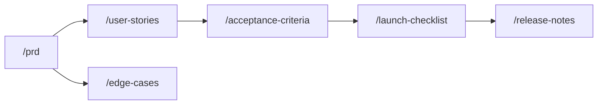

## How these skills connect

## Skills in this phase

| Skill | Description | Command |
|-------|-------------|---------|
| [deliver-acceptance-criteria](deliver-acceptance-criteria.md) | Generates structured Given/When/Then acceptance criteria for a user story or fea... | . |
| [deliver-edge-cases](deliver-edge-cases.md) | Documents edge cases, error states, boundary conditions, and recovery paths for ... | . |
| [deliver-launch-checklist](deliver-launch-checklist.md) | Creates a comprehensive pre-launch checklist covering engineering, design, marke... | . |
| [deliver-prd](deliver-prd.md) | Creates a comprehensive Product Requirements Document that aligns stakeholders o... | . |
| [deliver-release-notes](deliver-release-notes.md) | Creates user-facing release notes that communicate new features, improvements, a... | . |
| [deliver-user-stories](deliver-user-stories.md) | Generates user stories with clear acceptance criteria from product requirements ... | . |
