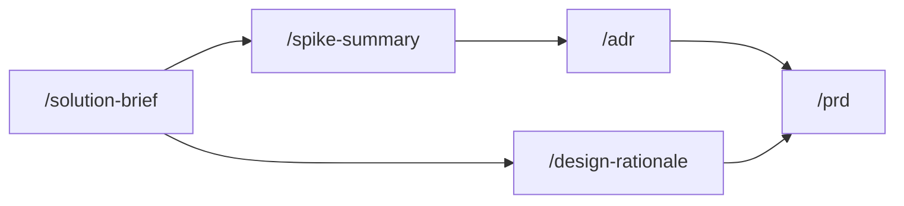

## How these skills connect

## Skills in this phase

| Skill | Description | Command |
|-------|-------------|---------|
| [develop-adr](develop-adr.md) | Creates an Architecture Decision Record following the Nygard format to document ... | . |
| [develop-design-rationale](develop-design-rationale.md) | Documents the reasoning behind design decisions including alternatives considere... | . |
| [develop-solution-brief](develop-solution-brief.md) | Creates a concise one-page solution overview that communicates the proposed appr... | . |
| [develop-spike-summary](develop-spike-summary.md) | Documents the results of a time-boxed technical or design exploration (spike). U... | . |
