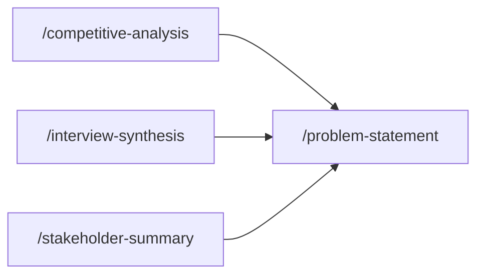

## How these skills connect

## Skills in this phase

| Skill | Description | Command |
|-------|-------------|---------|
| [discover-competitive-analysis](discover-competitive-analysis.md) | Creates a structured competitive analysis comparing features, positioning, and s... | . |
| [discover-interview-synthesis](discover-interview-synthesis.md) | Synthesizes user research interviews into actionable insights, patterns, and rec... | . |
| [discover-journey-map](discover-journey-map.md) | Produce a customer journey map covering stages, touchpoints, emotional curve, pa... | . |
| [discover-market-sizing](discover-market-sizing.md) | Estimate market opportunity (TAM, SAM, SOM) using multiple sizing frameworks (to... | . |
| [discover-stakeholder-summary](discover-stakeholder-summary.md) | Documents stakeholder needs, concerns, and influence for a project or initiative... | . |
