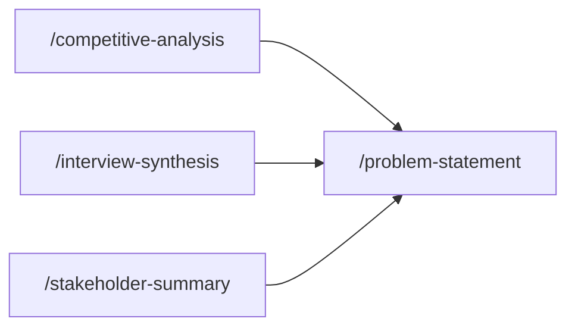

## How these skills connect

## Skills in this phase

| Skill | Description | Command |
|-------|-------------|---------|
| [discover-competitive-analysis](discover-competitive-analysis.md) | Creates a structured competitive analysis comparing features, positioning, and s... | `/competitive-analysis` |
| [discover-interview-synthesis](discover-interview-synthesis.md) | Synthesizes user research interviews into actionable insights, patterns, and rec... | `/interview-synthesis` |
| [discover-market-sizing](discover-market-sizing.md) | Creates a framework-driven market sizing artifact covering TAM, SAM, and SOM wit... | `/market-sizing` |
| [discover-stakeholder-summary](discover-stakeholder-summary.md) | Documents stakeholder needs, concerns, and influence for a project or initiative... | `/stakeholder-summary` |
