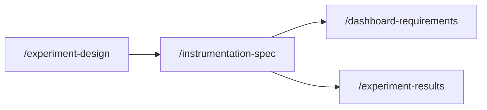

# Measure Skills

!!! warning "Generated file"
    This page is regenerated by `scripts/generate-skill-pages.py` from the `skills/measure/` directory. Re-run the generator after adding or changing skills.

## How these skills connect

## Skills in this phase

| Skill | Description | Command |
|-------|-------------|---------|
| [measure-dashboard-requirements](measure-dashboard-requirements.md) | Specifies requirements for an analytics dashboard including metrics, visualizati... | `/dashboard-requirements` |
| [measure-experiment-design](measure-experiment-design.md) | Designs an A/B test or experiment with clear hypothesis, variants, success metri... | `/experiment-design` |
| [measure-experiment-results](measure-experiment-results.md) | Documents the results of a completed experiment or A/B test with statistical ana... | `/experiment-results` |
| [measure-instrumentation-spec](measure-instrumentation-spec.md) | Specifies event tracking and analytics instrumentation requirements for a featur... | `/instrumentation-spec` |
| [measure-okr-grader](measure-okr-grader.md) | Scores completed OKR sets at cycle close with KR-level scoring per the canonical... | `/okr-grader` |
