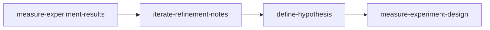

<!-- PM-Skills | https://github.com/product-on-purpose/pm-skills | Apache 2.0 -->

## Scenario

Brainshelf's PM runs the same loop every two weeks on the Resurface digest: read the last experiment's results, refine the backlog of digest ideas, frame the next hypothesis, design the next test. The overlap with the Lean Startup workflow is real, so this sample shows the Why Gate doing its job before the packet is generated. [fictional]

---

## Prompt

```
utility-pm-workflow-builder

need a workflow for the resurface tuning loop. every 2 weeks: look at last test's
results, clean up the idea backlog, pick the next hypothesis, design the next test.
basically results -> refinement-notes -> hypothesis -> experiment-design. new growth
hire starts next month and I want this repeatable, not in my head
```

---

## Output

# Workflow Implementation Packet: digest-experiment-loop

> Produced by `utility-pm-workflow-builder`. Everything below is a DRAFT in `_staging/workflows/digest-experiment-loop/`; nothing has been written to a canonical location.

## Decision

**Build it, after the Why Gate.** Lean Startup covers a similar skill set, so the gate asked for specific scenarios where it fails. Evidence accepted:

1. "The loop STARTS from last cycle's results" - Lean Startup starts from a fresh hypothesis and treats results as the end; this loop is a cycle whose entry point is the readout.
2. "No pivot decision every two weeks" - Lean Startup's terminal step is pivot-or-persevere; a tuning loop makes that call quarterly at most, and forcing it each cycle produces theater.
3. "Backlog refinement is the bridge" - the idea backlog between readout and next hypothesis has no home in Lean Startup; it is where the new hire will actually live.

- **Workflow name:** `digest-experiment-loop` (file: `_workflows/digest-experiment-loop.md`)
- **Command:** `/workflow-digest-experiment-loop`
- **Steps:** `measure-experiment-results` -> `iterate-refinement-notes` -> `define-hypothesis` -> `measure-experiment-design`
- **Entry form:** skills-first (the user named the sequence; names validated against `skills/`)

## Overlap Analysis

Scanned the live `_workflows/` directory. Meaningful overlaps:

| Existing workflow | What it covers | Overlap | Why it does not fit |
|---|---|---|---|
| lean-startup | hypothesis -> experiment-design -> experiment-results -> pivot-decision | High (shares three skills) | Linear validation arc ending in a pivot call; this is a recurring cycle entered at the results end, with backlog refinement as the bridge and no per-cycle pivot decision |
| post-launch-learning | instrumentation -> dashboards -> results -> retro -> lessons | Medium (shares results) | One-time post-ship learning, not a standing optimization cadence |

Gap: a standing two-week optimization cycle: readout in, next designed test out, with the idea backlog refined in between. (Overlap with lean-startup is high on skills but below the kill threshold on COVERAGE: the cycle entry point, the refinement bridge, and the absence of a pivot step are structural differences, accepted via Why Gate evidence above.)

## Workflow Draft

```markdown
---
title: Digest Experiment Loop
---

# Digest Experiment Loop Workflow

> **Close the loop on a recurring experiment cadence: last readout in, refined backlog and the next designed test out.**

---

## Workflow Metadata

| Field | Value |
|-------|-------|
| **Workflow** | Digest Experiment Loop |
| **Command** | `/workflow-digest-experiment-loop` |
| **Skills** | `measure-experiment-results` -> `iterate-refinement-notes` -> `define-hypothesis` -> `measure-experiment-design` |
| **Phases Covered** | Measure, Iterate, Define |
| **Estimated Duration** | 1-2 hours per cycle |
| **Prerequisite Inputs** | The completed experiment's data; the running idea backlog |
| **Final Output** | Results readout, refined idea backlog, framed hypothesis, and the next experiment design |

---

## When to Use This Workflow

Use the Digest Experiment Loop workflow when:

- A recurring optimization cadence (weekly or biweekly) turns each readout into the next test
- A feature in sustained tuning needs its experiment pipeline to survive a personnel handoff

**Do NOT use this workflow when:**

- You are validating whether to build something at all (use [Lean Startup](lean-startup.md), which ends in a pivot-or-persevere call)
- The experiment program is ending and you need the learning wrap-up (use [Post-Launch Learning](post-launch-learning.md))

---

## Workflow Steps

### Step 1: Experiment Results

**Skill:** [`measure-experiment-results`](../skills/measure-experiment-results/SKILL.md)

**What you do:** Write up the just-completed experiment: outcome against the success metric, segments that behaved differently, and the learning.

**Input requirements:**

- The experiment's data export or dashboard view
- The original experiment design (for the success criteria)

**Output:** A results readout with outcome, confidence, and learnings.

**Handoff to next step:** The learnings and surprised-us observations become new or re-ranked items in the idea backlog the next step refines.

---

### Step 2: Refinement Notes

**Skill:** [`iterate-refinement-notes`](../skills/iterate-refinement-notes/SKILL.md)

**What you do:** Refine the digest idea backlog against the new learnings: re-rank, kill stale ideas, capture scope notes on the top candidates.

**Input requirements:**

- The running idea backlog
- Learnings from Step 1

**Output:** Refinement notes with the re-ranked backlog and the top candidate clearly scoped.

**Handoff to next step:** The top-ranked candidate (with its scope notes) is the raw material the hypothesis frames.

---

### Step 3: Hypothesis

**Skill:** [`define-hypothesis`](../skills/define-hypothesis/SKILL.md)

**What you do:** Frame the top candidate as a testable hypothesis with a success metric and validation approach.

**Input requirements:**

- The top candidate from Step 2
- The metric baseline from Step 1's readout

**Output:** A testable hypothesis with success metrics.

**Handoff to next step:** The hypothesis and its success metric are the direct input to the experiment design; the baseline from Step 1 feeds the sample-size math.

---

### Step 4: Experiment Design

**Skill:** [`measure-experiment-design`](../skills/measure-experiment-design/SKILL.md)

**What you do:** Design the next test: variants, success metrics, sample size, and duration for the framed hypothesis.

**Input requirements:**

- The hypothesis from Step 3
- Current traffic and baseline numbers

**Output:** A ready-to-run experiment design; the cycle re-enters at Step 1 when it completes.

---

## Context Flow Diagram



---

## Tips and Variations

**Recurring use:** Keep one running backlog document; Step 2 edits it in place each cycle so the artifact trail stays in one file per quarter.

**Quarterly checkpoint:** Every six cycles, run `iterate-pivot-decision` on the program as a whole; the per-cycle loop deliberately excludes it.

---

## Quality Checklist

Before considering this workflow complete, verify:

- [ ] The readout states the outcome against the ORIGINAL success criteria (no moved goalposts)
- [ ] Every learning in Step 1 is reflected in the backlog (added, re-ranked, or explicitly dismissed)
- [ ] The hypothesis tests exactly one thing and names its metric
- [ ] The experiment design's sample-size math uses the current baseline, not last quarter's

---

## See Also

- [Lean Startup](lean-startup.md) - first-time validation ending in a pivot-or-persevere call
- [Post-Launch Learning](post-launch-learning.md) - wrapping up a learning program after ship

---

*Part of [PM-Skills](../README.md) - Open source Product Management skills for AI agents*
```

## Command Draft

```markdown
---
description: Run the Digest Experiment Loop workflow (experiment-results -> refinement-notes -> hypothesis -> experiment-design)
---

Run the Digest Experiment Loop workflow to turn the last readout into the next designed test.

This workflow uses multiple skills in sequence. For each step, read the skill instructions and follow them to create the artifact.

## Workflow Steps

### Step 1: Experiment Results

Use the `measure-experiment-results` skill from `skills/measure-experiment-results/SKILL.md`.

### Step 2: Refinement Notes

Use the `iterate-refinement-notes` skill from `skills/iterate-refinement-notes/SKILL.md`.

### Step 3: Hypothesis

Use the `define-hypothesis` skill from `skills/define-hypothesis/SKILL.md`.

### Step 4: Experiment Design

Use the `measure-experiment-design` skill from `skills/measure-experiment-design/SKILL.md`.

## Output

Create all four artifacts in sequence, ensuring each builds on the previous.

Reference the Digest Experiment Loop workflow at `_workflows/digest-experiment-loop.md` for additional guidance.

Context from user: $ARGUMENTS
```

## Cross-Cutting Checklist

- [ ] `_workflows/digest-experiment-loop.md` created - `check-workflow-generator-coverage` (enforcing); the site page is generated automatically
- [ ] `commands/workflow-digest-experiment-loop.md` created - `validate-commands` (enforcing)
- [ ] `AGENTS.md` workflows section + command list - `validate-agents-md`, `check-agents-md-command-sync` (enforcing)
- [ ] `README.md` workflow table row + count phrasings - `check-count-consistency` (enforcing)
- [ ] `QUICKSTART.md` count phrasings - `check-count-consistency` (enforcing)
- [ ] `site/src/content/docs/index.mdx` workflow table + count line - `check-landing-page-counts --strict` (enforcing)
- [ ] `site/src/content/docs/reference/runtime-components.md` counts line - `check-count-consistency` (enforcing)
- [ ] `.github/workflows/release.yml` release-note slash-command bullet - **validator-blind**; update by hand
- [ ] `CHANGELOG.md` entry under `[Unreleased]`
- [ ] `node scripts/gen-resource-index.mjs` if CI asks - `gen-resource-index --check` (CI-only)

## Promotion Steps

1. Move the drafts to `_workflows/digest-experiment-loop.md` and `commands/workflow-digest-experiment-loop.md`.
2. Work the Cross-Cutting Checklist in order.
3. Run the named validators locally; let CI run regardless.
4. Open a PR; squash-merge per repo convention.
