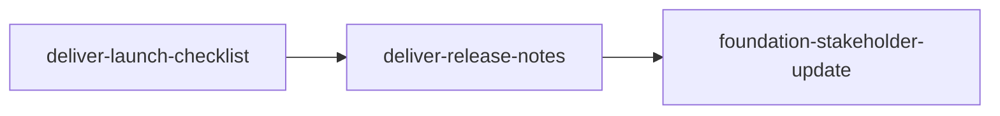

<!-- PM-Skills | https://github.com/product-on-purpose/pm-skills | Apache 2.0 -->

## Scenario

Storevine ships campaign-template releases for its email marketing product every few weeks. Each release runs the same sequence: launch readiness check, merchant-facing release notes, internal stakeholder update. After the third `/chain` run, the orchestrator's completion output suggested promoting the chain; the PM hands the builder that exact chain expression. [fictional]

---

## Prompt

```
utility-pm-workflow-builder

Entry: chain promotion. Originating chain expression from the orchestrator suggestion:
deliver-launch-checklist -> deliver-release-notes -> foundation-stakeholder-update

Context the runs used: "Campaign template release for Storevine merchants - readiness,
merchant comms, internal update."

Constraints: this recurs every release; we want the handoffs written down so any PM on
the Campaigns team can run it the same way.
```

---

## Output

# Workflow Implementation Packet: campaign-launch

> Produced by `utility-pm-workflow-builder`. Everything below is a DRAFT in `_staging/workflows/campaign-launch/`; nothing has been written to a canonical location.

## Decision

**Build it.** The Why Gate fired against Feature Kickoff and Post-Launch Learning and was passed with specific evidence:

1. "Template release every 2-3 weeks" is a recurring comms-and-readiness loop; Feature Kickoff frames a NEW feature from the problem up and would re-litigate settled scope every run.
2. "Merchant release notes and the internal update must tell the same story" requires both artifacts in one pass; no existing workflow sequences release notes with a stakeholder update.
3. Post-Launch Learning starts AFTER ship (instrumentation, results); this loop ends at ship.

- **Workflow name:** `campaign-launch` (file: `_workflows/campaign-launch.md`)
- **Command:** `/workflow-campaign-launch`
- **Steps:** `deliver-launch-checklist` -> `deliver-release-notes` -> `foundation-stakeholder-update`
- **Entry form:** chain-promotion (expression above, verbatim from the orchestrator suggestion)

## Overlap Analysis

Scanned the live `_workflows/` directory. Meaningful overlaps:

| Existing workflow | What it covers | Overlap | Why it does not fit |
|---|---|---|---|
| feature-kickoff | Problem -> hypothesis -> PRD -> stories -> launch checklist | Medium (shares the checklist) | Frames a new feature from scratch; this loop assumes a settled template and recurs per release |
| post-launch-learning | Instrumentation -> dashboards -> results -> retro | Low (adjacent in time) | Starts after ship; this loop ends at ship |

Gap: a recurring ship-comms loop (readiness, external notes, internal update) with shared narrative across the three artifacts.

## Workflow Draft

```markdown
---
title: Campaign Launch
---

# Campaign Launch Workflow

> **Take a campaign-template release from readiness check to merchant comms and the internal update, with one consistent story.**

---

## Workflow Metadata

| Field | Value |
|-------|-------|
| **Workflow** | Campaign Launch |
| **Command** | `/workflow-campaign-launch` |
| **Skills** | `deliver-launch-checklist` -> `deliver-release-notes` -> `foundation-stakeholder-update` |
| **Phases Covered** | Deliver, Foundation (cross-cutting) |
| **Estimated Duration** | 1-2 hours |
| **Prerequisite Inputs** | The release scope (templates shipping, dates), known risks, merchant-facing changes |
| **Final Output** | Launch checklist, merchant release notes, and the internal stakeholder update |

---

## When to Use This Workflow

Use the Campaign Launch workflow when:

- A campaign-template release is approaching and readiness, merchant comms, and internal comms all need to land together
- A recurring release cadence needs consistent, repeatable ship materials

**Do NOT use this workflow when:**

- The feature itself is still being defined (use [Feature Kickoff](feature-kickoff.md))
- The release already shipped and you want learnings (use [Post-Launch Learning](post-launch-learning.md))

---

## Workflow Steps

### Step 1: Launch Checklist

**Skill:** [`deliver-launch-checklist`](../skills/deliver-launch-checklist/SKILL.md)

**What you do:** Build the readiness checklist for this release across engineering, support, marketing, and operations.

**Input requirements:**

- Release scope and target date
- Known risks or open dependencies

**Output:** A pre-launch checklist with owners and status per readiness area.

**Handoff to next step:** The checklist's "merchant-visible changes" items define exactly what the release notes must cover; unresolved checklist items become the release notes' known-limitations candidates.

---

### Step 2: Release Notes

**Skill:** [`deliver-release-notes`](../skills/deliver-release-notes/SKILL.md)

**What you do:** Write merchant-facing release notes for the template release, benefit-first.

**Input requirements:**

- Merchant-visible changes from Step 1
- Tone and channel conventions for merchant comms

**Output:** Channel-ready release notes for merchants.

**Handoff to next step:** The release notes' headline benefits become the internal update's "what shipped" section, so internal and external narratives never diverge.

---

### Step 3: Stakeholder Update

**Skill:** [`foundation-stakeholder-update`](../skills/foundation-stakeholder-update/SKILL.md)

**What you do:** Write the internal update (leadership and customer-facing teams): what shipped, expected merchant impact, and what support should watch for.

**Input requirements:**

- Release notes from Step 2
- Checklist status from Step 1 (anything support should monitor)

**Output:** An internal stakeholder update with the primary call to action up front.

---

## Context Flow Diagram



---

## Tips and Variations

**Recurring use:** Clone the prior release's checklist as the starting point; only the scope section changes most releases.

**Enhanced version:** Append `foundation-meeting-recap` after the go/no-go meeting when the release needs a decision record.

---

## Quality Checklist

Before considering this workflow complete, verify:

- [ ] Every merchant-visible change in the checklist appears in the release notes
- [ ] Release notes lead with merchant benefit, not implementation detail
- [ ] The internal update's "what shipped" matches the release notes one-to-one
- [ ] Unresolved checklist items are either closed or explicitly flagged in the internal update

---

## See Also

- [Feature Kickoff](feature-kickoff.md) - when the feature is still being defined
- [Post-Launch Learning](post-launch-learning.md) - after ship, for measurement and learnings

---

*Part of [PM-Skills](../README.md) - Open source Product Management skills for AI agents*
```

## Command Draft

```markdown
---
description: Run the Campaign Launch workflow (launch-checklist -> release-notes -> stakeholder-update)
---

Run the Campaign Launch workflow to produce readiness, merchant comms, and the internal update for a campaign-template release.

This workflow uses multiple skills in sequence. For each step, read the skill instructions and follow them to create the artifact.

## Workflow Steps

### Step 1: Launch Checklist

Use the `deliver-launch-checklist` skill from `skills/deliver-launch-checklist/SKILL.md`.

### Step 2: Release Notes

Use the `deliver-release-notes` skill from `skills/deliver-release-notes/SKILL.md`.

### Step 3: Stakeholder Update

Use the `foundation-stakeholder-update` skill from `skills/foundation-stakeholder-update/SKILL.md`.

## Output

Create all three artifacts in sequence, ensuring each builds on the previous.

Reference the Campaign Launch workflow at `_workflows/campaign-launch.md` for additional guidance.

Context from user: $ARGUMENTS
```

## Cross-Cutting Checklist

- [ ] `_workflows/campaign-launch.md` created - `check-workflow-generator-coverage` (enforcing); the site page is generated automatically
- [ ] `commands/workflow-campaign-launch.md` created - `validate-commands` (enforcing)
- [ ] `AGENTS.md` workflows section + command list - `validate-agents-md`, `check-agents-md-command-sync` (enforcing)
- [ ] `README.md` workflow table row + count phrasings - `check-count-consistency` (enforcing)
- [ ] `QUICKSTART.md` count phrasings - `check-count-consistency` (enforcing)
- [ ] `site/src/content/docs/index.mdx` workflow table + count line - `check-landing-page-counts --strict` (enforcing)
- [ ] `site/src/content/docs/reference/runtime-components.md` counts line - `check-count-consistency` (enforcing)
- [ ] `.github/workflows/release.yml` release-note slash-command bullet - **validator-blind**; update by hand
- [ ] `CHANGELOG.md` entry under `[Unreleased]`
- [ ] `node scripts/gen-resource-index.mjs` if CI asks - `gen-resource-index --check` (CI-only)

## Promotion Steps

1. Move the drafts to `_workflows/campaign-launch.md` and `commands/workflow-campaign-launch.md`.
2. Work the Cross-Cutting Checklist in order.
3. Run the named validators locally; let CI run regardless.
4. Open a PR; squash-merge per repo convention.
