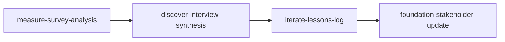

<!-- PM-Skills | https://github.com/product-on-purpose/pm-skills | Apache 2.0 -->

## Scenario

Workbench rolls out its Blueprints document-template system to enterprise customers in staged waves. After each wave, the platform PM reviews survey feedback, synthesizes admin interviews, banks the lessons, and reports to affected accounts. The PM brings a problem-first request with explicit process requirements. [fictional]

---

## Prompt

```
utility-pm-workflow-builder

Request type: new workflow (problem-first).

Problem: After each staged Blueprints rollout wave (8-12 enterprise accounts per wave),
we run an ad-hoc review. Inputs: the rollout feedback survey (sent to all admins in the
wave) and 4-6 recorded admin interviews. Required outputs, in order:
  1. Survey analysis with segment cuts (account size, vertical)
  2. Interview synthesis reconciled against the survey findings
  3. A lessons entry for the rollout playbook (institutional memory)
  4. A customer-facing rollout report for the wave's account teams

Process requirements: repeatable across waves, runnable by any platform PM, each step's
input contract explicit.
```

---

## Output

# Workflow Implementation Packet: enterprise-rollout-review

> Produced by `utility-pm-workflow-builder`. Everything below is a DRAFT in `_staging/workflows/enterprise-rollout-review/`; nothing has been written to a canonical location.

## Decision

**Build it.** The Why Gate fired against Post-Launch Learning and Customer Discovery and was passed:

1. "Survey AND interviews reconciled" - Post-Launch Learning is metrics-first (instrumentation, dashboards); this review is research-first with two qualitative sources that must agree before anything is reported.
2. "A customer-facing report per wave" - no existing workflow ends in an external communication; Post-Launch Learning ends at team retro and lessons.
3. "Runs per wave, 8-12 accounts at a time" - Customer Discovery frames a problem from research once; this is a standing per-wave operational review.

- **Workflow name:** `enterprise-rollout-review` (file: `_workflows/enterprise-rollout-review.md`)
- **Command:** `/workflow-enterprise-rollout-review`
- **Steps:** `measure-survey-analysis` -> `discover-interview-synthesis` -> `iterate-lessons-log` -> `foundation-stakeholder-update`
- **Entry form:** problem-first

## Overlap Analysis

Scanned the live `_workflows/` directory. Meaningful overlaps:

| Existing workflow | What it covers | Overlap | Why it does not fit |
|---|---|---|---|
| post-launch-learning | instrumentation -> dashboards -> experiment-results -> retrospective -> lessons-log | Medium (shares the lessons step) | Metrics-first single-launch learning; no survey, no interview synthesis, no external report |
| customer-discovery | interview-synthesis -> jtbd -> opportunity-tree -> problem-statement | Medium (shares interview synthesis) | Frames a NEW problem from research; this review evaluates a known rollout and ends in comms |

Gap: a research-first, per-wave operational review that reconciles two feedback sources, banks playbook lessons, and ends in a customer-facing report.

## Workflow Draft

```markdown
---
title: Enterprise Rollout Review
---

# Enterprise Rollout Review Workflow

> **After each staged rollout wave: analyze the survey, reconcile the interviews, bank the lessons, and report to the wave's accounts.**

---

## Workflow Metadata

| Field | Value |
|-------|-------|
| **Workflow** | Enterprise Rollout Review |
| **Command** | `/workflow-enterprise-rollout-review` |
| **Skills** | `measure-survey-analysis` -> `discover-interview-synthesis` -> `iterate-lessons-log` -> `foundation-stakeholder-update` |
| **Phases Covered** | Measure, Discover, Iterate, Foundation (cross-cutting) |
| **Estimated Duration** | 3-4 hours per wave |
| **Prerequisite Inputs** | The wave's survey export; interview recordings or transcripts; the rollout playbook |
| **Final Output** | Survey analysis, interview synthesis, a playbook lessons entry, and the customer-facing rollout report |

---

## When to Use This Workflow

Use the Enterprise Rollout Review workflow when:

- A staged rollout wave just completed and its feedback needs to become playbook improvements plus a customer report
- Multiple PMs run the same review and the process must produce comparable artifacts across waves

**Do NOT use this workflow when:**

- You are exploring an unframed problem space from research (use [Customer Discovery](customer-discovery.md))
- The rollout is instrumented and you want the metrics-first learning loop (use [Post-Launch Learning](post-launch-learning.md))

---

## Workflow Steps

### Step 1: Survey Analysis

**Skill:** [`measure-survey-analysis`](../skills/measure-survey-analysis/SKILL.md)

**What you do:** Analyze the wave's rollout feedback survey with segment cuts by account size and vertical.

**Input requirements:**

- The survey export for this wave
- Segment definitions (account size bands, verticals)

**Output:** A survey analysis with response rates, per-segment findings, and flagged anomalies.

**Handoff to next step:** The per-segment findings and anomalies become the hypotheses the interview synthesis confirms, refutes, or explains.

---

### Step 2: Interview Synthesis

**Skill:** [`discover-interview-synthesis`](../skills/discover-interview-synthesis/SKILL.md)

**What you do:** Synthesize the wave's admin interviews, explicitly reconciling each survey finding from Step 1: confirmed, contradicted, or explained.

**Input requirements:**

- Interview transcripts or recordings for the wave
- The survey findings from Step 1

**Output:** An interview synthesis with patterns, evidence quotes, and a reconciliation table against the survey findings.

**Handoff to next step:** Reconciled findings (where both sources agree, or the disagreement is explained) are eligible to become lessons; unreconciled findings are flagged for the next wave's instruments instead.

---

### Step 3: Lessons Log

**Skill:** [`iterate-lessons-log`](../skills/iterate-lessons-log/SKILL.md)

**What you do:** Bank the wave's reconciled findings as lessons entries in the rollout playbook: what to repeat, what to change, and what to instrument next wave.

**Input requirements:**

- The reconciled findings from Step 2
- The current rollout playbook (for placement and to avoid duplicate lessons)

**Output:** Playbook lessons entries with context, evidence, and the recommended practice change.

**Handoff to next step:** The lessons that affect CUSTOMERS (changed rollout practices, fixed issues, known limitations) feed the report; internal-only lessons stay in the playbook.

---

### Step 4: Stakeholder Update

**Skill:** [`foundation-stakeholder-update`](../skills/foundation-stakeholder-update/SKILL.md)

**What you do:** Write the customer-facing rollout report for the wave's account teams: what the wave surfaced, what changed as a result, and what the next wave's accounts should expect.

**Input requirements:**

- Customer-relevant lessons from Step 3
- The account list for the wave (audience: customer-facing variant)

**Output:** A channel-ready rollout report for account teams to share with their enterprise customers.

---

## Context Flow Diagram



---

## Tips and Variations

**Recurring use:** Keep the reconciliation table format identical across waves; quarter-end synthesis across waves becomes a simple concatenation exercise.

**Enhanced version:** When a wave surfaces a strategic question (not just operational findings), follow with `define-problem-statement` to frame it for the roadmap discussion.

**Team collaboration:** Step 1 can run as soon as the survey closes (analyst or PM); Steps 2-4 wait for the final interview.

---

## Quality Checklist

Before considering this workflow complete, verify:

- [ ] Survey analysis reports response rate per segment, not just overall
- [ ] Every Step 1 finding appears in Step 2's reconciliation table with a verdict (confirmed / contradicted / explained)
- [ ] No lesson is banked from an unreconciled finding
- [ ] The customer report contains only customer-relevant lessons (internal practice changes stay in the playbook)

---

## See Also

- [Customer Discovery](customer-discovery.md) - framing a new problem from research
- [Post-Launch Learning](post-launch-learning.md) - the metrics-first learning loop after a launch

---

*Part of [PM-Skills](../README.md) - Open source Product Management skills for AI agents*
```

## Command Draft

```markdown
---
description: Run the Enterprise Rollout Review workflow (survey-analysis -> interview-synthesis -> lessons-log -> stakeholder-update)
---

Run the Enterprise Rollout Review workflow to turn a rollout wave's feedback into playbook lessons and the customer report.

This workflow uses multiple skills in sequence. For each step, read the skill instructions and follow them to create the artifact.

## Workflow Steps

### Step 1: Survey Analysis

Use the `measure-survey-analysis` skill from `skills/measure-survey-analysis/SKILL.md`.

### Step 2: Interview Synthesis

Use the `discover-interview-synthesis` skill from `skills/discover-interview-synthesis/SKILL.md`.

### Step 3: Lessons Log

Use the `iterate-lessons-log` skill from `skills/iterate-lessons-log/SKILL.md`.

### Step 4: Stakeholder Update

Use the `foundation-stakeholder-update` skill from `skills/foundation-stakeholder-update/SKILL.md`.

## Output

Create all four artifacts in sequence, ensuring each builds on the previous.

Reference the Enterprise Rollout Review workflow at `_workflows/enterprise-rollout-review.md` for additional guidance.

Context from user: $ARGUMENTS
```

## Cross-Cutting Checklist

- [ ] `_workflows/enterprise-rollout-review.md` created - `check-workflow-generator-coverage` (enforcing); the site page is generated automatically
- [ ] `commands/workflow-enterprise-rollout-review.md` created - `validate-commands` (enforcing)
- [ ] `AGENTS.md` workflows section + command list - `validate-agents-md`, `check-agents-md-command-sync` (enforcing)
- [ ] `README.md` workflow table row + count phrasings - `check-count-consistency` (enforcing)
- [ ] `QUICKSTART.md` count phrasings - `check-count-consistency` (enforcing)
- [ ] `site/src/content/docs/index.mdx` workflow table + count line - `check-landing-page-counts --strict` (enforcing)
- [ ] `site/src/content/docs/reference/runtime-components.md` counts line - `check-count-consistency` (enforcing)
- [ ] `.github/workflows/release.yml` release-note slash-command bullet - **validator-blind**; update by hand
- [ ] `CHANGELOG.md` entry under `[Unreleased]`
- [ ] `node scripts/gen-resource-index.mjs` if CI asks - `gen-resource-index --check` (CI-only)

## Promotion Steps

1. Move the drafts to `_workflows/enterprise-rollout-review.md` and `commands/workflow-enterprise-rollout-review.md`.
2. Work the Cross-Cutting Checklist in order.
3. Run the named validators locally; let CI run regardless.
4. Open a PR; squash-merge per repo convention.
