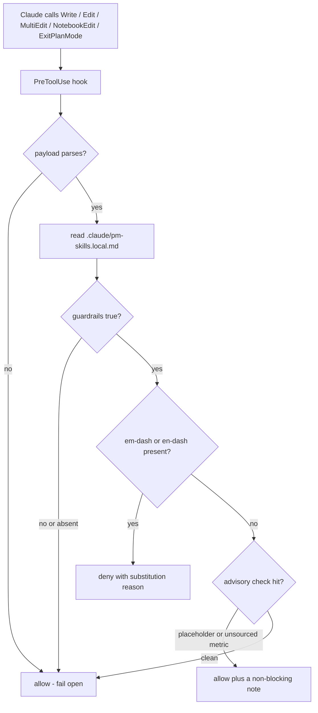
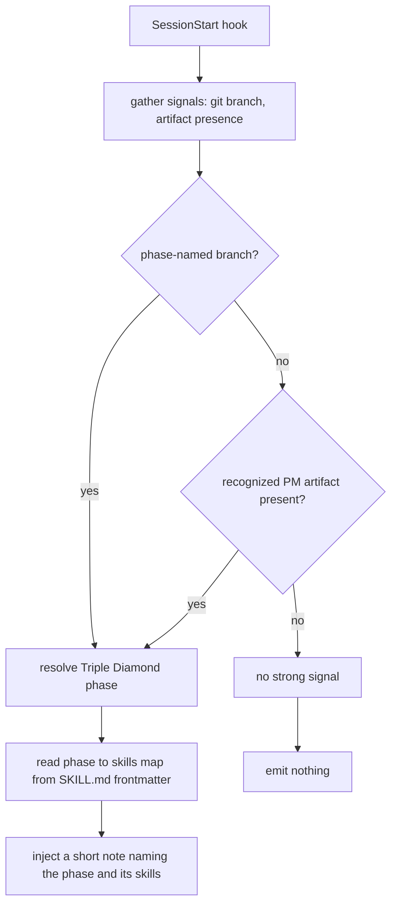
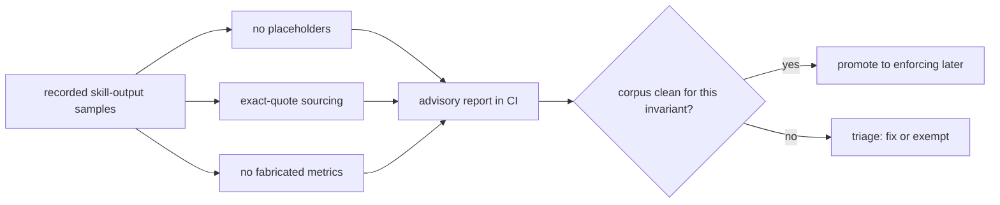

## Table of Contents

- [What this is](#what-this-is)
- [House-rule guardrails (opt-in)](#house-rule-guardrails-opt-in)
- [Configuring guardrails](#configuring-guardrails)
- [Phase router (on, confident-only)](#phase-router-on-confident-only)
- [Output-quality checks (advisory CI)](#output-quality-checks-advisory-ci)
- [FAQ](#faq)

## What this is

pm-skills ships two Claude Code **hooks** plus an advisory CI tier. They wire the skill library into the platform: guarding what gets written, surfacing the right skill for where you are, and verifying recorded output quality. Hooks are a Claude Code primitive, so the guardrails and router are Claude Code features; the portable surface across other clients remains the skills themselves.

Two principles run through the design:

- **A block needs consent.** The guardrails can deny a write, so they ship **off** and you opt in per project.
- **A nudge needs confidence.** The router only ever adds a suggestion, so it ships **on** but stays silent unless a repo signal is strong.

## House-rule guardrails (opt-in)

A `PreToolUse` hook that runs the moment Claude is about to write a file. It is **inert until you opt in**. When enabled it blocks em-dash and en-dash characters (returning a substitution reminder to the model) and warns (never blocks) on unfilled placeholders and unsourced numeric metrics. It fails open: any error, missing config, or malformed input lets the write through, so a hook bug can never block your unrelated work.



The hook fires on Claude's tool calls, not on what you type by hand, so it only ever gates writes Claude is about to make. It also scans the plan text when Claude exits plan mode (`ExitPlanMode`), so a banned character cannot slip in through a plan that is presented but not yet a normal file write.

## Configuring guardrails

Guardrails are controlled by a gitignored, per-project file, `.claude/pm-skills.local.md`, with YAML frontmatter. With no file, nothing happens. To enable them:

```yaml
---
guardrails: true
guardrail_checks: [em-dash, placeholder, fabricated-metric]
---
```

| Key | Values | Effect |
|---|---|---|
| `guardrails` | `true` / `false` (default: absent = off) | Master switch. Nothing fires unless this is `true`. |
| `guardrail_checks` | a list of: `em-dash`, `placeholder`, `fabricated-metric` (default: `[em-dash]`) | Which checks run. `em-dash` BLOCKS; the other two WARN. Quoted items (`["em-dash"]`) work too. |

Only `em-dash` ever blocks a write; `placeholder` and `fabricated-metric` emit a non-blocking note for the model to act on.

## Phase router (on, confident-only)

A `SessionStart` hook that suggests the right Triple Diamond skills for where you are. It reads two cheap signals: a phase-named git branch (`discover/...`, `define/...`, `develop/...`, `deliver/...`, `measure/...`, `iterate/...`), or a recognized PM artifact present in the repo. On a **strong** signal it injects a short note naming the phase and a few relevant skills (read straight from each skill's `phase:` frontmatter). With no strong signal it stays completely silent, so it never becomes noise. If recognized artifacts point to *different* phases (say a PRD and a dashboard spec in the same repo), that is treated as ambiguous and the router stays silent rather than guessing by file order; a phase-named branch still resolves it.



## Output-quality checks (advisory CI)

A CI-time tier (not a hook) that checks the recorded skill-output samples for quality invariants, not just structure. Three deterministic validators run advisory (they never fail a build today): no leftover placeholder markers, exact-quote sourcing (every source-ledger quote is a verbatim substring of the sample's input), and no fabricated metrics (a percentage in the output not traceable to the input). Two are already clean on the corpus and are candidates to become enforcing; the metrics check is a heuristic that flags percentages for human review.



## FAQ

**Does the guardrail hook block my own typing?** No. Hooks fire on Claude's tool calls, not on what you type by hand.

**Will the router nag me every session?** No. It is silent unless a repo signal is strong (a phase-named branch or a recognized artifact).

**Do these work outside Claude Code?** Hooks are a Claude Code primitive, so the guardrails and router are Claude Code features. The portable surface across clients remains the skills.

**Where is the implementation?** In the repo's `hooks/` directory; see `hooks/README.md` for the architecture (dependency-free Node, fail-open, how to add a check).
