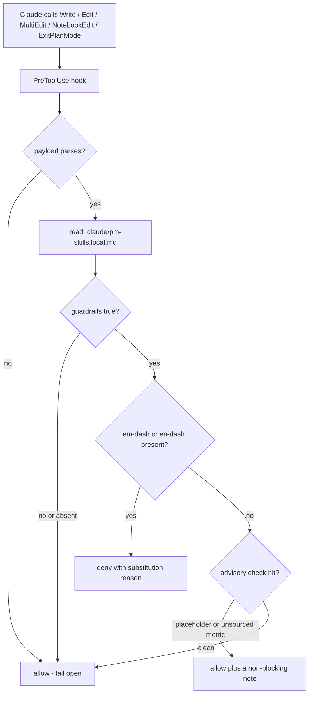
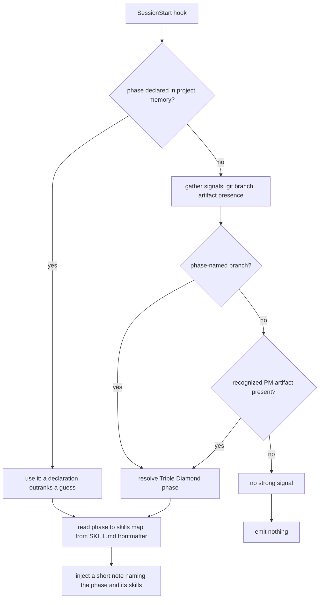
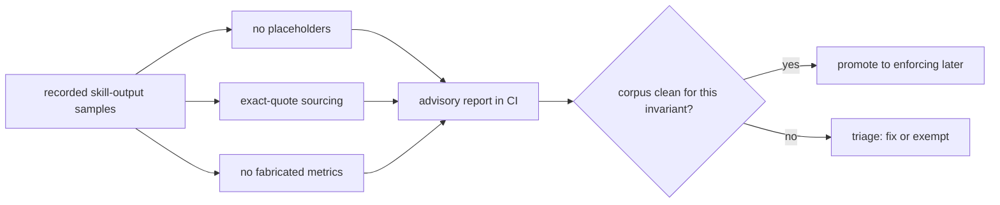

## Table of Contents

- [What this is](#what-this-is)
- [House-rule guardrails (opt-in)](#house-rule-guardrails-opt-in)
- [Configuring guardrails](#configuring-guardrails)
- [Phase router (on, confident-only)](#phase-router-on-confident-only)
- [Project memory (opt-in)](#project-memory-opt-in)
- [Output-quality checks (advisory CI)](#output-quality-checks-advisory-ci)
- [FAQ](#faq)

## What this is

pm-skills ships two Claude Code **hooks** plus an advisory CI tier. They wire the skill library into the platform: guarding what gets written, surfacing the right skill for where you are, and verifying recorded output quality. Hooks are a Claude Code primitive, so the guardrails and router are Claude Code features; the portable surface across other clients remains the skills themselves.

Two principles run through the design:

- **A block needs consent.** The guardrails can deny a write, so they ship **off** and you opt in per project.
- **A nudge needs confidence.** The router only ever adds a suggestion, so it ships **on** but stays silent unless a repo signal is strong.
- **A write needs both.** Project memory writes to files in your project, so it is opt-in like the guardrails, and it proposes changes for confirmation rather than applying them.

## House-rule guardrails (opt-in)

A `PreToolUse` hook that runs the moment Claude is about to write a file. It is **inert until you opt in**. When enabled it blocks em-dash and en-dash characters (returning a substitution reminder to the model) and warns (never blocks) on unfilled placeholders and unsourced numeric metrics. It fails open: any error, missing config, or malformed input lets the write through, so a hook bug can never block your unrelated work.


```mermaid
flowchart TD
    A[Claude calls Write / Edit / MultiEdit / NotebookEdit / ExitPlanMode] --> B[PreToolUse hook]
    B --> C{payload parses?}
    C -->|no| ALLOW[allow - fail open]
    C -->|yes| D[read .claude/pm-skills.local.md]
    D --> E{guardrails true?}
    E -->|no or absent| ALLOW
    E -->|yes| F{em-dash or en-dash present?}
    F -->|yes| DENY[deny with substitution reason]
    F -->|no| G{advisory check hit?}
    G -->|placeholder or unsourced metric| WARN[allow plus a non-blocking note]
    G -->|clean| ALLOW
```

The hook fires on Claude's tool calls, not on what you type by hand, so it only ever gates writes Claude is about to make. It also scans the plan text when Claude exits plan mode (`ExitPlanMode`), so a banned character cannot slip in through a plan that is presented but not yet a normal file write.

## Configuring guardrails

Guardrails are controlled by a per-project file, `.claude/pm-skills.local.md`, with YAML frontmatter. Add it to your `.gitignore` before creating it: it is local configuration, and once project memory is in use it also holds your initiative and recorded decisions. With no file, nothing happens. To enable them:

```yaml
---
guardrails: true
guardrail_checks: [em-dash, placeholder, fabricated-metric]
---
```

| Key | Values | Effect |
|---|---|---|
| `guardrails` | `true` / `false` (default: absent = off) | Master switch. Nothing fires unless this is `true`. |
| `guardrail_checks` | a list of: `em-dash`, `placeholder`, `fabricated-metric` (default: `[em-dash]`) | Which checks run. `em-dash` BLOCKS; the other two WARN. Quoted items (`["em-dash"]`) work too. |

Only `em-dash` ever blocks a write; `placeholder` and `fabricated-metric` emit a non-blocking note for the model to act on.

## Phase router (on, confident-only)

A `SessionStart` hook that suggests the right Triple Diamond skills for where you are. If you have opted into [project memory](#project-memory-opt-in) and recorded a `phase:` there, the router uses it and says so; a phase you wrote down is a statement, not something to guess at. Otherwise it falls back to two cheap signals: a phase-named git branch (`discover/...`, `define/...`, `develop/...`, `deliver/...`, `measure/...`, `iterate/...`), or a recognized PM artifact present in the repo. On a **strong** signal it injects a short note naming the phase and a few relevant skills (read straight from each skill's `phase:` frontmatter). With no strong signal it stays completely silent, so it never becomes noise. If recognized artifacts point to *different* phases (say a PRD and a dashboard spec in the same repo), that is treated as ambiguous and the router stays silent rather than guessing by file order; a phase-named branch still resolves it.


```mermaid
flowchart TD
    S[SessionStart hook] --> M{phase declared in project memory?}
    M -->|yes| D[use it: a declaration outranks a guess]
    M -->|no| G[gather signals: git branch, artifact presence]
    G --> B{phase-named branch?}
    B -->|yes| P[resolve Triple Diamond phase]
    B -->|no| A{recognized PM artifact present?}
    A -->|yes| P
    A -->|no| Q[no strong signal]
    Q --> SILENT[emit nothing]
    D --> L[read phase to skills map from SKILL.md frontmatter]
    P --> L
    L --> N[inject a short note naming the phase and its skills]
```

## Project memory (opt-in)

Skills normally start cold: every session you re-supply which phase you are in, what you are working on, and what you already produced. Project memory lets a project record that once, in the same `.claude/pm-skills.local.md` the guardrails and router already use, so the catalog compounds across a session instead of restarting.

**It is inert unless you create the file.** With no file, every skill and both hooks behave exactly as they did before, which is the whole trust posture: nothing reads or writes your project until you ask it to.

### Turning it on

1. **Ignore the file first.** Add `.claude/pm-skills.local.md` to your project's `.gitignore` before you create it. It will hold your current initiative, recorded decisions, and paths to internal artifacts, which is not usually content you want in version control, and in a public repository is content you almost certainly do not. Nothing ignores it for you.
2. **Create it** with the two keys that do the work:

   ```yaml
   ---
   schema: 1
   phase: discover
   active_initiative: "Self-serve onboarding"
   ---
   ```

3. **Run a skill that reads it.** Start a session and run `discover-interview-synthesis` on your research. When it finishes it will offer to record what it produced. Confirm.
4. **Run the next skill.** Run `deliver-prd`. It reads the personas the previous skill recorded instead of asking you to paste them again. That handoff is the whole feature; everything else is plumbing that makes it safe.

Update `phase` as you move through the Triple Diamond. The router reads it at session start and stops guessing from your branch name.

**See it worked through.** Two samples in the library demonstrate exactly this handoff on the Storevine thread: [the interview synthesis that records its personas](../samples/discover-interview-synthesis/sample_discover-interview-synthesis_storevine_sms-optin.md) and [the PRD written afterward](../samples/deliver-prd/sample_deliver-prd_storevine_sms-optin.md) that reads them. Compare that PRD's 11-line prompt against the 32-line prompt in [the v1 email PRD](../samples/deliver-prd/sample_deliver-prd_storevine_campaigns.md) covering the same initiative without memory. The difference is entirely context the second prompt did not have to restate.

### Which skills read it

Eight skills carry a `## Project Memory Contract` as of v2.33.0. Anything not on this list ignores the file entirely.

| Skill | Reads | Writes |
|---|---|---|
| `discover-interview-synthesis` | initiative | personas and findings, as `interpretation` |
| `deliver-prd` | initiative, prior `interpretation` artifacts | the PRD as `decision`, plus scope and metrics to `## Decisions` |
| `foundation-okr-writer` | initiative, prior artifacts | the OKR set as `decision` |
| `iterate-retrospective` | initiative, prior artifacts | lessons as `interpretation` |
| `foundation-meeting-agenda` | initiative | nothing; an agenda plans a meeting that has not happened |
| `foundation-meeting-brief` | initiative | nothing; the brief is preparation |
| `foundation-meeting-recap` | initiative | decisions reached, plus the recap as `decision` |
| `foundation-meeting-synthesize` | initiative | the synthesis as `interpretation` |

The two pure readers are deliberate. The meeting family already chains its own artifacts by filename, so memory carries durable product context across meetings rather than duplicating a mechanism that works.

```yaml
---
schema: 1
phase: deliver                          # a Triple Diamond phase, or omit
active_initiative: "Self-serve onboarding"
memory_auto_append: false               # default; see below
---

## Notes
Freeform context worth carrying (constraints, open threads).

## Decisions
Durable choices, each dated and attributed to the skill or person that recorded it.
```

| Key | Values | Effect |
|---|---|---|
| `schema` | `1` | Schema version. |
| `phase` | one of `discover`, `define`, `develop`, `deliver`, `measure`, `iterate` | The router uses this instead of guessing. An unrecognized value is ignored and the router falls back to its signals, so a typo never makes it announce a phase that does not exist. |
| `active_initiative` | a short line, or `null` | What you are currently working on. Surfaced only alongside a declared phase. |
| `memory_auto_append` | `true` / `false` (default: absent = `false`) | Whether skills may append to this file without asking. |

**Writes are proposed, not applied.** By default a skill shows you the entry it wants to record and waits for confirmation. Setting `memory_auto_append: true` opts into appending directly, with an echo of what was written. The default is deliberately the cautious one: the guardrails ship off because a block needs consent, and memory writes ship as propose-then-confirm for the same reason. Note the asymmetry with the router, which ships **on** and fails open on a malformed value: the router only ever adds a suggestion, while this touches files you own.

**Skills do the file I/O, not the hooks.** A memory-aware skill carries a `## Project Memory Contract` section stating what it reads and what it appends. The hook reads only `phase` and `active_initiative`, the two keys it needs to route; everything else is read by the agent following the skill's instructions. There is no daemon, no database, and no MCP server involved.

### What skills record: `artifacts[]` and `## Decisions`

The keys above are what the *hook* reads. Skills read and append two more things, and because no runtime parses or normalizes them, the shape below is the whole contract. It is specified here rather than left to each skill, since two skills that invent different shapes cannot hand off to each other, which is the entire point of the feature.

`artifacts[]` is an optional frontmatter list, newest first, that records what the catalog has already produced for this project:

```yaml
artifacts:
  - skill: discover-interview-synthesis
    title: "Onboarding interviews synthesis"
    path: docs/research/onboarding-synthesis.md
    produced: 2026-06-17
    provenance: interpretation
    summary: "5 interviews; 3 personas emerged (new-admin, power-user, evaluator)"
```

| Field | Required | Meaning |
|---|---|---|
| `skill` | yes | The skill that produced it, by catalog name. |
| `title` | yes | A short human label. |
| `provenance` | yes | One of the four tags below. |
| `produced` | yes | ISO date. |
| `path` | no | Repo-relative path, when the artifact landed in a file. Omit for something that only ever existed in the conversation. |
| `summary` | no | One line a downstream skill can read instead of opening the file. |

Every artifact and decision carries exactly one provenance tag, so a downstream skill can weight what it reads:

| Tag | Meaning | Example |
|---|---|---|
| `observation` | Raw, sourced data | an interview quote, a measured metric |
| `interpretation` | A pattern read from observations | "3 personas emerged" |
| `hypothesis` | A testable claim | "new-admins churn at setup step 3" |
| `decision` | A committed choice | "ship guided onboarding for new-admins first" |

The distinction is load-bearing rather than decorative: it is what lets a reader notice that a decision rests only on hypotheses.

`## Decisions` is a prose section, not frontmatter. Each entry is a durable choice with its date and the skill or person that recorded it. It is deliberately not a YAML list, because decisions carry reasoning that does not survive being flattened into fields.

**Concurrent writes: what is guaranteed, and what is not.** Every contract that writes carries a **Write discipline** bullet requiring the skill to re-read the file immediately before writing, merge its entry into current state rather than overwriting, and re-propose if the file changed since the proposal was drafted. The `check-memory-contracts` validator enforces that a writing contract states this.

What that buys is an *instruction*, not a guarantee. Nothing enforces it at runtime: a skill is text an agent follows, the agent chooses its own edit primitive, and the validator checks the declaration rather than the resulting file. So the honest position is that two sessions writing the same file are now told how to avoid clobbering each other, and are not prevented from it. If you have ignored the file as recommended, a bad write is not recoverable through git either. Eight skills ship a contract, six of which write; treat the file as a convenience that compounds context, not as a system of record.

## Output-quality checks (advisory CI)

A CI-time tier (not a hook) that checks the recorded skill-output samples for quality invariants, not just structure. Three deterministic validators run advisory (they never fail a build today): no leftover placeholder markers, exact-quote sourcing (every source-ledger quote is a verbatim substring of the sample's input), and no fabricated metrics (a percentage in the output not traceable to the input). Two are already clean on the corpus and are candidates to become enforcing; the metrics check is a heuristic that flags percentages for human review.


```mermaid
flowchart LR
    SAMPLES[recorded skill-output samples] --> V1[no placeholders]
    SAMPLES --> V2[exact-quote sourcing]
    SAMPLES --> V3[no fabricated metrics]
    V1 --> R[advisory report in CI]
    V2 --> R
    V3 --> R
    R --> P{corpus clean for this invariant?}
    P -->|yes| E[promote to enforcing later]
    P -->|no| T[triage: fix or exempt]
```

## FAQ

**Does the guardrail hook block my own typing?** No. Hooks fire on Claude's tool calls, not on what you type by hand.

**Will the router nag me every session?** No. It is silent unless a repo signal is strong (a phase-named branch or a recognized artifact).

**Do these work outside Claude Code?** Hooks are a Claude Code primitive, so the guardrails and router are Claude Code features. The portable surface across clients remains the skills.

**Where is the implementation?** In the repo's `hooks/` directory; see `hooks/README.md` for the architecture (dependency-free Node, fail-open, how to add a check).
