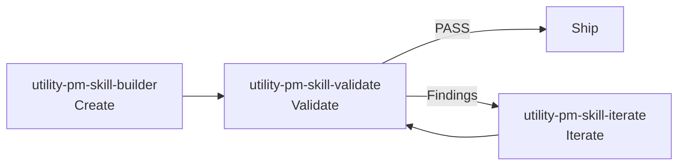

<!-- pmskills:quickstart:start (generated by scripts/gen-derived-surfaces.mjs; edit scripts/data/quickstart-fragment.md, not this block) -->
## What's Included

- **68 shipped PM skills in `skills/`** (30 phase skills across 6 phases, 11 foundation skills, 12 utility skills, 15 tool skills)
- **11 slash-command docs in `commands/`** (10 `/workflow-*` orchestrator commands + the `/chain` command)
- **12 Workflows** for multi-skill processes (Triple Diamond, Lean Startup, Feature Kickoff, and 9 more)

## Installation

### Claude Code (recommended)

Install from the plugin marketplace, no clone required:

```
/plugin marketplace add product-on-purpose/agent-plugins
/plugin install pm-skills@product-on-purpose
```

All 68 skills are available immediately. Invoke any by name, for example `/pm-skills:deliver-prd`. Already on the old `pm-skills-marketplace`? It keeps working; see [Setup by Platform](platforms.md) to switch homes.

### Cross-agent (Cursor, GitHub Copilot, Cline, and others)

```bash
npx skills add product-on-purpose/pm-skills
```

Installs all 68 skills into your agent's default skills directory via the open [skills CLI](https://github.com/vercel-labs/skills). No clone, no sync.

### Claude.ai / Claude Desktop

1. Go to **Settings > Capabilities** (Desktop) or **Project Settings > Add Files** (Claude.ai)
2. Upload the latest release ZIP (`pm-skills-vX.X.X.zip`) from [Releases](https://github.com/product-on-purpose/pm-skills/releases)
3. Skills are now available in your conversations

### Clone or download (everything included)

```bash
git clone https://github.com/product-on-purpose/pm-skills.git
```

Or download and extract the latest ZIP from [Releases](https://github.com/product-on-purpose/pm-skills/releases). Point any other agent to `AGENTS.md` for skill discovery; each skill is self-contained in `skills/{skill-name}/SKILL.md` (for example `skills/deliver-prd/SKILL.md`).

More detail: see the [full getting-started guide](index.md) for the long-form walkthrough.

## Verify It Worked

Confirm the install landed before you start building:

- **Claude Code**: run `/plugin list` to confirm `pm-skills` is installed, then invoke `/pm-skills:deliver-prd "test feature"` and expect a complete PRD artifact back.
- **Claude.ai / Claude Desktop**: ask "Use the prd skill to create requirements for a test feature" and expect a complete PRD artifact back.
- **Other AI agents** (Cursor, Windsurf, Copilot, Gemini CLI, and similar): ask "Use the hypothesis skill to test my assumption about checkout abandonment" and expect a structured hypothesis artifact back.

If you get a generic response instead of a structured artifact, the agent has not discovered the skill; see [Setup by Platform](platforms.md) for troubleshooting.

## Usage

### Slash Commands

```
/pm-skills:deliver-prd "Feature description"
/pm-skills:define-hypothesis "Assumption to test"
/pm-skills:deliver-acceptance-criteria "Story or feature slice"
/pm-skills:deliver-user-stories "PRD or feature context"
/pm-skills:discover-competitive-analysis "Market or product area"
```

See `AGENTS.md` for the complete command list.

### Workflows

Run multi-skill workflows:

```
/workflow-feature-kickoff "Feature name"  # Problem → Hypothesis → PRD → Stories
```

Workflow definitions are in `_workflows/`.

## Skill Lifecycle Tools

Three utility skills manage the skill library itself:



See the [pm-skill-lifecycle guide](../guides/pm-skill-lifecycle.md) for detailed workflow patterns.

## File Structure

```
skills/            # All 68 skill definitions (30 phase + 11 foundation + 12 utility + 15 tool, flat)
commands/          # 11 command markdown files (10 workflow + /chain)
_workflows/        # Multi-skill workflows
scripts/           # sync, validation, and release helpers
.claude/pm-skills-for-claude.md  # instructions for Claude Code users
AGENTS.md          # Agent discovery index
```

For Claude Code discovery, run `./scripts/sync-claude.sh` (or `.ps1`) to populate `.claude/skills` and `.claude/commands` from the flat source.

## Learn More

- Full documentation: [pm-skills docs home](../)
- Skill specification: https://agentskills.io/specification

---

*Built by [Product on Purpose](https://github.com/product-on-purpose) for PMs who ship.*
<!-- pmskills:quickstart:end -->
