Not sure which skill to use? Start here.

## By what you need to do

```mermaid
flowchart TD
    A{"What do you need to do?"} -- "Understand the\nmarket or users" --> DISCOVER
    A -- "Frame the\nproblem" --> DEFINE
    A -- "Design the\nsolution" --> DEVELOP
    A -- "Ship the\nfeature" --> DELIVER
    A -- "Measure\nresults" --> MEASURE
    A -- "Learn and\nimprove" --> ITERATE

    DISCOVER{"Discover"} -- "Analyze competitors" --> S1["discover-competitive-analysis"]
    DISCOVER -- "Synthesize interviews" --> S2["discover-interview-synthesis"]
    DISCOVER -- "Map stakeholders" --> S3["discover-stakeholder-summary"]

    DEFINE{"Define"} -- "State the problem" --> S4["define-problem-statement"]
    DEFINE -- "Form a hypothesis" --> S5["define-hypothesis"]
    DEFINE -- "Map opportunities" --> S6["define-opportunity-tree"]
    DEFINE -- "Understand jobs-to-be-done" --> S7["define-jtbd-canvas"]

    DEVELOP{"Develop"} -- "Propose a solution" --> S8["develop-solution-brief"]
    DEVELOP -- "Record a tech spike" --> S9["develop-spike-summary"]
    DEVELOP -- "Document a decision" --> S10["develop-adr"]
    DEVELOP -- "Explain design rationale" --> S11["develop-design-rationale"]

    DELIVER{"Deliver"} -- "Write requirements" --> S12["deliver-prd"]
    DELIVER -- "Write user stories" --> S13["deliver-user-stories"]
    DELIVER -- "Define acceptance criteria" --> S14["deliver-acceptance-criteria"]
    DELIVER -- "Document edge cases" --> S15["deliver-edge-cases"]
    DELIVER -- "Prepare for launch" --> S16["deliver-launch-checklist"]
    DELIVER -- "Announce the release" --> S17["deliver-release-notes"]

    MEASURE{"Measure"} -- "Design an experiment" --> S18["measure-experiment-design"]
    MEASURE -- "Specify tracking" --> S19["measure-instrumentation-spec"]
    MEASURE -- "Define a dashboard" --> S20["measure-dashboard-requirements"]
    MEASURE -- "Analyze results" --> S21["measure-experiment-results"]

    ITERATE{"Iterate"} -- "Run a retrospective" --> S22["iterate-retrospective"]
    ITERATE -- "Log a lesson" --> S23["iterate-lessons-log"]
    ITERATE -- "Refine the backlog" --> S24["iterate-refinement-notes"]
    ITERATE -- "Decide: pivot or persevere" --> S25["iterate-pivot-decision"]
```

## By artifact type

| I need a... | Use | Phase |
|------------|-----|-------|
| Architecture Decision Record | `/pm-skills:develop-adr` | Develop |
| Acceptance criteria | `/pm-skills:deliver-acceptance-criteria` | Deliver |
| Backlog refinement notes | `/pm-skills:iterate-refinement-notes` | Iterate |
| Competitive analysis | `/pm-skills:discover-competitive-analysis` | Discover |
| Dashboard requirements | `/pm-skills:measure-dashboard-requirements` | Measure |
| Design rationale | `/pm-skills:develop-design-rationale` | Develop |
| Edge cases document | `/pm-skills:deliver-edge-cases` | Deliver |
| Experiment design | `/pm-skills:measure-experiment-design` | Measure |
| Experiment results | `/pm-skills:measure-experiment-results` | Measure |
| Hypothesis | `/pm-skills:define-hypothesis` | Define |
| Instrumentation spec | `/pm-skills:measure-instrumentation-spec` | Measure |
| Interview synthesis | `/pm-skills:discover-interview-synthesis` | Discover |
| JTBD canvas | `/pm-skills:define-jtbd-canvas` | Define |
| Launch checklist | `/pm-skills:deliver-launch-checklist` | Deliver |
| Lessons learned | `/pm-skills:iterate-lessons-log` | Iterate |
| Opportunity tree | `/pm-skills:define-opportunity-tree` | Define |
| Persona | `/pm-skills:foundation-persona` | Foundation |
| Pivot/persevere decision | `/pm-skills:iterate-pivot-decision` | Iterate |
| PRD | `/pm-skills:deliver-prd` | Deliver |
| Problem statement | `/pm-skills:define-problem-statement` | Define |
| Release notes | `/pm-skills:deliver-release-notes` | Deliver |
| Retrospective | `/pm-skills:iterate-retrospective` | Iterate |
| Solution brief | `/pm-skills:develop-solution-brief` | Develop |
| Spike summary | `/pm-skills:develop-spike-summary` | Develop |
| Stakeholder summary | `/pm-skills:discover-stakeholder-summary` | Discover |
| User stories | `/pm-skills:deliver-user-stories` | Deliver |

## By phase

| Phase | Focus | Skills |
|-------|-------|--------|
| [Discover](../skills/discover/) | Research and context | competitive-analysis, interview-synthesis, stakeholder-summary |
| [Define](../skills/define/) | Problem framing | problem-statement, hypothesis, opportunity-tree, jtbd-canvas |
| [Develop](../skills/develop/) | Solution design | solution-brief, spike-summary, adr, design-rationale |
| [Deliver](../skills/deliver/) | Handoff and launch | prd, user-stories, acceptance-criteria, edge-cases, launch-checklist, release-notes |
| [Measure](../skills/measure/) | Data and testing | experiment-design, instrumentation-spec, dashboard-requirements, experiment-results |
| [Iterate](../skills/iterate/) | Learning and adapting | retrospective, lessons-log, refinement-notes, pivot-decision |
| [Foundation](../skills/foundation/) | Cross-cutting | persona |
| [Utility](../skills/utility/) | Skill lifecycle | pm-skill-builder, pm-skill-validate, pm-skill-iterate |

## Still not sure?

- **Confused between two skills?** Check the [PM-Skill Comparisons](pm-skill-comparisons.md) page
- **Want a multi-step workflow?** Check the [Recipes](recipes.md) page
- **Want to see real output?** Check the [Showcase](../showcase/) to see every skill in action
