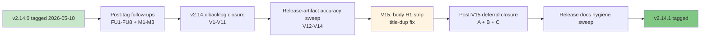

**Released**: 2026-05-10 (same day as v2.14.0)
**Type**: Patch release
**Skill count**: 40 (unchanged from v2.14.0)
**Key theme**: Polish + v2.14.0 ship-time regression fix

---

## TL;DR

v2.14.1 is a same-day patch following the v2.14.0 doc-stack migration to Astro Starlight. The 40-skill catalog is unchanged; day-to-day usage of `/prd`, `/hypothesis`, `/user-stories`, and the rest of the catalog is identical. What changes is the docs-site rendering and CI infrastructure:

- **Title duplication fixed across every Starlight-rendered page.** v2.14.0 shipped with a migration regression: Starlight auto-renders the frontmatter `title:` as the page heading, but MkDocs Material did not. Our content (62 hand-authored docs + 6 generator emission sites) also started with `# Heading` matching the title. Both rendered. Spotted on mobile spot-check of `/showcase/workbench/`, `/skills/define/`, and `/skills/define/define-hypothesis/` after v2.14.0 shipped.
- **Generator output reframed for users.** The `:::caution[Generated file]` admonition that auto-emitted on 63 pages (per-skill, per-phase, workflows, showcase, commands reference) was contributor-noise on the rendered docs site. Removed; the Pattern 5C generated-content marker (frontmatter `generated: true` + `source:`) is preserved as the validator anchor.
- **Mermaid 3-layer beautification + canonical style guide.** Global theme (indigo lineColor + system-ui font) via `astro-mermaid` themeVariables; SVG polish (edge stroke-width, node corner-radius, cluster fill-opacity) via custom CSS; Triple Diamond palette via `classDef` and `style` on home page diagrams. Plus a new reference: `docs/reference/mermaid-style-guide.md` + self-contained `public/mermaid-style-guide.html` with diagram-type decision matrix and machine-readable YAML spec for agents.
- **CI validators promoted to truly enforcing.** `check-internal-link-validity` and `validate-docs-frontmatter` shipped at v2.14.0 with `enforcing` labels in CI but ran in advisory mode (no `--strict` flag), so findings did not fail CI. v2.14.1 promotes both to truly enforcing on Ubuntu + Windows. Plus a new third enforcing validator (`check-no-body-h1`) for forward enforcement against the V15 title-duplication regression class.
- **MCP maintenance posture codified.** Cross-repo: `pm-skills-mcp/pm-skills-source.json` metadata updated to v2.14.0 + `maintenance: true` flag. pm-skills: `validate-mcp-sync.yml` default mode flipped to `observe`; the validator now reads the maintenance flag and treats drift as expected when set. The pm-skills-mcp catalog stays frozen at v2.9.2 build per the M-22 maintenance-mode decision; CI no longer surfaces "drift" as failure.

For users invoking pm-skills via slash commands, plugin marketplace, sync helper, or `npx skills add`: no behavioral change. The 40 skills, 47 commands, and 9 workflows are identical to v2.14.0.

For contributors: tighter CI gates (body-H1 lint now enforced; previously-relaxed `check-internal-link-validity` and `validate-docs-frontmatter` now truly enforce). Authoring conventions documented in `CONTRIBUTING.md` "Maintainer notes: architectural workarounds" section (now 6 entries; was 5).

---

## What changed

### Fixed

- **Title duplication on every Starlight-rendered page** (V15). 62 hand-authored docs + 6 generator emission sites stripped of body H1. Workflow generator additionally strips source `# Workflow Name` H1 from `_workflows/*.md` at the copy boundary so source files stay standalone-readable on GitHub. Production verified: 1 H1 per page (was 2).
- **5 stale `v2.13.1` surfaces refreshed to `v2.14.0`** (FU1). README shields.io badge URL, "Latest stable", "Latest release notes" anchor, "Published tag"; `docs/index.mdx` Recent Releases row; `.claude/pm-skills-for-claude.md` "as of v2.13.1" note.
- **`docs/changelog.md` gap closed** (FU3). v2.13.0 + v2.13.1 entries were missing despite ~150 days between v2.12.0 and v2.14.0; backfilled to mirror root `CHANGELOG.md`.
- **Generator output contributor-noise removed** (V10). 63 generator-output pages no longer emit the `:::caution[Generated file]` admonition. `docs/skills/index.md` "Hand-edited curated index" note also removed. Pattern 5C generated-content marker (frontmatter `generated: true` + `source:`) preserved.
- **182 en-dashes swept across 45 library sample files** (V11). Pre-existing latency exposed by V10 regeneration; sample-authoring previously bypassed the no-em-dashes hook because generator-script writes are not Edit/Write tool calls. Replaced with space-hyphen-space per CLAUDE.md substitute.
- **7 broken doubled-docs-prefix links in `docs/skills/foundation/foundation-meeting-*.md`** (FU6). Generator path-rewrite (`rewrite_internal_paths()` translates `../../docs/` to `../../` at copy boundary) closes the link breakage; bash + pwsh parity gap that hid the issue (Windows Git Bash `grep -P` locale) closed via `LC_ALL=C.UTF-8` fallback.
- **`/reference/` and `/samples/` 404s + redirect base-path bug** (B2.5; landed before v2.14.0 tag but documented here for the post-tag narrative). All three resolved.

### Added

- **`scripts/check-no-body-h1.{sh,ps1,md}`** (post-V15 deferral closure C). Bash + PowerShell validator triplet that refuses any `docs/**/*.{md,mdx}` file (subject to `EXCLUDE_PATHS`) where the first non-blank, non-import, non-comment line after the closing frontmatter `---` is a `# H1` matching the frontmatter title. Wired as enforcing CI step pair in `.github/workflows/validation.yml`. Forward enforcement against V15 regression class.
- **`docs/reference/mermaid-style-guide.md` + `public/mermaid-style-guide.html`** (FU8). Canonical Mermaid diagram reference with decision matrix for diagram-type selection, Triple Diamond palette spec, 5 diagram-type examples (graph LR, block-beta, sequenceDiagram, stateDiagram-v2, gantt), dark mode audit notes, and a machine-readable YAML spec for agents. Self-contained HTML preview opens locally or serves at `/pm-skills/mermaid-style-guide.html`.
- **7 README.md stubs** across `docs/{skills,guides,concepts,contributing,getting-started,showcase,releases}/` (FU7). Short pointer files (workflows + reference precedent) so each docs section has a GitHub-directory landing page. Excluded from Astro build via `!docs/**/README.md` glob.
- **`docs/internal/dependency-policy.md` "Known accepted CVEs (static-site exemption)" section** (B3.5 P1.2; landed before v2.14.0 tag, documented here for completeness). Documents the 5 advisories on `astro ~5.13.0` that are not-applicable to pm-skills' SSG runtime profile.
- **`CONTRIBUTING.md` "Maintainer notes: architectural workarounds" section** (V2 + post-V15 deferral closure A). 6 documented workarounds future-maintainers should NOT "fix": autogenerate `docs/` prefix; post-build `.md` link sweep; EXCLUDE_PATHS mirroring; generator path-rewrite; LC_ALL fallback; Starlight title-vs-body-H1 convention.
- **`MIN_EDIT_LINKS` threshold env var** in `scripts/verify-edit-links.mjs` (V3). Default 100; catches silent regression where editLink emission breaks.
- **`maintenance: true` flag + `maintenanceNote`** in `pm-skills-mcp/pm-skills-source.json` (V9; cross-repo commit `7e9cac5` in pm-skills-mcp). Documents the M-22 frozen-catalog posture explicitly.

### Changed

- **`check-internal-link-validity.{sh,ps1}` promoted to truly enforcing** in CI (FU6). Added `--strict` / `-Strict` flag. Also expanded scope to include `.mdx` files in V6 (docs/index.mdx + docs/showcase/index.mdx now scanned).
- **`validate-docs-frontmatter.{sh,ps1}` promoted to truly enforcing** in CI (V5). Added `--strict` / `-Strict` flag. Required cleaning 20 docs (19 missing descriptions; 1 too-short; 9 needed YAML quote-wrapping for embedded colons).
- **`validate-mcp-sync.yml` default mode flipped from `block` to `observe`** (V9). Plus the underlying `validate-mcp-sync.js` now reads `pmSkillsSourceData.maintenance` and treats drift as expected when true (post-V15 deferral closure B). Makes `pm-skills-mcp/pm-skills-source.json` authoritative for maintenance posture; CONTRIBUTING.md "MCP Sync Guardrail" section updated.
- **9 GitHub Actions workflow files bumped** to `@v5` for `checkout`, `setup-node`, `upload-pages-artifact`, `deploy-pages` (FU4). Ahead of forced Node 20 cutoff 2026-06-02.
- **Mermaid 3-layer beautification** (M1+M2+M3). M1 themeVariables (`lineColor: '#5C7CFA'` + system-ui font + 14px font-size); M2 SVG CSS polish (edge stroke-width 1.75px + node corner-radius 6 + cluster fill-opacity 0.4); M3 Triple Diamond classDef palette applied to home page graph LR + block-beta diagrams.
- **Validator inventory**: 23 → 24 (+1 check-no-body-h1). Truly enforcing tier: 11 → 14 (+1 each from FU6, V5, C).

### Disabled

- **`sync-agents-md.yml` auto-trigger removed** (V7). Workflow had been failing on every `skills/**` push since 2026-04-23 because its `skills/$phase/*/` glob did not match the flat `skills/{phase-name}/` structure pm-skills uses. AGENTS.md is hand-authored as canonical contributor-facing content. `workflow_dispatch` kept for future revival.

### Compatibility

- **No content changes.** All 40 skills, 47 slash commands, 9 workflows, 115 library samples (mounted), and source-side editing flows are unchanged from v2.14.0.
- **Codex compatibility unaffected.** Codex (and any non-Claude-Code agent) reads from `skills/` and `AGENTS.md` directly; the post-tag cleanup is invisible to source-skill consumers.
- **Sync-helper, `npx skills add`, and plugin marketplace install paths unaffected.**
- **`pm-skills-mcp` companion server unaffected at runtime.** The cross-repo source.json metadata update (V9) is documentation only; the embedded skills catalog is unchanged.
- **CI step pair counts changed**: `validation.yml` adds 2 new step pairs for the `check-no-body-h1` validator (bash + pwsh; both enforcing with `--strict` / `-Strict`).

---

## Why this matters

For users, v2.14.1 is the release that makes the v2.14.0 docs site look right. The title duplication on every Starlight-rendered page (most visible on `/showcase/workbench/`, skill pages, and phase indexes) was a migration regression that the W11 visual smoke test cropped past. v2.14.1 strips body H1 across 62 hand-authored docs + 6 generator emission sites; production verified clean.

For contributors and forkers, v2.14.1 hardens CI from advisory-in-name-only to truly enforcing. Three validators now refuse to merge work that breaks the rule: `check-internal-link-validity` (no broken internal links), `validate-docs-frontmatter` (every doc has title + description), `check-no-body-h1` (frontmatter title is the page heading; no body H1 dup). v2.14.0's "enforcing tier 11" was nominal; v2.14.1's "enforcing tier 14" is real.

For maintainers, the architectural workaround docs in CONTRIBUTING.md preserve durable knowledge about decisions future contributors might be tempted to "clean up" (autogenerate `docs/` prefix; post-build `.md` link sweep; EXCLUDE_PATHS arrays; generator path-rewrite; LC_ALL fallback; Starlight title-vs-body-H1 convention). The Mermaid style guide gives both authors and agents a structured reference for diagram styling.

---

## Counts at v2.14.1

| Surface | Count | Note |
|---|---|---|
| Skills | 40 | unchanged from v2.14.0 (26 phase + 8 foundation + 6 utility) |
| Workflows | 9 | unchanged |
| Slash commands | 47 | 40 skill + 7 workflow |
| Library samples | 115 | mounted under /samples/; v2.14.1 swept 182 en-dashes across 45 sample files |
| Validators (total) | 24 | +1 from v2.14.0 tag (new check-no-body-h1 enforcing); was 23 |
| Validators (enforcing) | 14 | +3 from v2.14.0 tag (FU6 check-internal-link-validity promoted; V5 validate-docs-frontmatter promoted; C check-no-body-h1 added enforcing); was 11 |
| Validators (advisory) | 10 | -2 from v2.14.0 tag (2 promoted); was 12 |
| Pages built | 241 | up from 239 at v2.14.0 tag (+7 README stubs + Mermaid style guide MD/HTML + samples/index.md + reference/index.md + Release_v2.14.1.md offset by V15 H1-strip changes); production verified |
| Architectural workarounds documented in CONTRIBUTING.md | 6 | +1 from v2.14.0 tag (Starlight title-vs-body-H1 convention added) |
| Redirect entries preserved | 12 | unchanged from v2.14.0 |
| Mermaid blocks across pages | 31 | rendered client-side via astro-mermaid; v2.14.1 adds branded lineColor + Triple Diamond classDef on home page |
| pm-skills-mcp tools (frozen at v2.9.2 build) | 59 | maintenance posture documented; cross-repo metadata bumped to v2.14.0 + maintenance: true flag |

---

## What's deferred to v2.15+

| Item | Reason |
|---|---|
| Astro 6 + Node 22.12+ upgrade | Decision 11 in v2.14 cycle plan; reserved as the v2.15.0 cycle |
| JS theme-listener for true dark-mode-adaptive Mermaid (V1) | Current solid-pastel palette works in both modes; rgba alpha hurts text contrast in dark; a JS-based theme-listener is the cleaner solution but out of v2.14.x scope |
| Library samples scope expansion in link validator (V6 partial) | .mdx done; library/skill-output-samples/ path structure complicates the find/EXCLUDE_PATHS pattern |
| URL slug normalization for `/releases/Release_vX.Y.Z/` | Preserves case + dots currently; functional but non-conventional |
| `sync-agents-md.yml` full rewrite for flat `skills/{phase-name}/` structure | V7 was tactical disable; full rewrite to walk the flat structure correctly is v2.15+ |
| `CONTEXT.md` Skills Inventory per-phase tables refresh | Still at v2.10.x-era 32-skill state per intentional deferral; not refreshed in v2.14.x |

---

## Validation

Codex final review re-dispatched as background task (after the prior PR.2 review at v2.14.0 tag time) covering V12-V15 + A+B+C. Result fetchable via `/codex:result task-mp0dpjy6-d406bb` when complete. Mechanical CI: all 14 enforcing validators PASS on Ubuntu + Windows; build PASS 241 pages clean; em-dash + en-dash discipline 0/0 across all post-tag changes.

| Layer | Coverage |
|---|---|
| Production verification | 4 critical URLs return 200 + 1 H1 per page (down from 2 before V15) + Mermaid SVGs render with M3 classDef colors + redirect base-path lands at /pm-skills/ targets |
| CI on tag commit | All workflows green; check-no-body-h1 (new), check-internal-link-validity --strict (promoted), validate-docs-frontmatter --strict (promoted) all PASS on Ubuntu + Windows |
| Codex PR.2 (v2.14.0 tag) | 0 P0, 3 P1, 4 P2, 2 P3; all P1 resolved before/at tag; P2 resolved in post-tag V batches |
| Codex final review (v2.14.1) | Re-dispatched; background |

---

## Related artifacts

- v2.14.0 release notes (the migration cycle): [`Release_v2.14.0.md`](./Release_v2.14.0.md)
- Master migration plan (closed; covers Phases 0-4 + W13 sub-batches): [`docs/internal/release-plans/v2.14.0/plan_v2.14_starlight-migration.md`](../internal/release-plans/v2.14.0/plan_v2.14_starlight-migration.md)
- Mermaid style guide (new in v2.14.1; canonical reference): [`docs/reference/mermaid-style-guide.md`](../reference/mermaid-style-guide.md)
- Mermaid style guide HTML preview (new in v2.14.1; self-contained): [`/pm-skills/mermaid-style-guide.html`](https://product-on-purpose.github.io/pm-skills/mermaid-style-guide.html)
- Architectural workaround docs (CONTRIBUTING.md): https://github.com/product-on-purpose/pm-skills/blob/main/CONTRIBUTING.md#maintainer-notes-architectural-workarounds
- Dependency policy + Astro 5.13.x CVE exemption (carry-forward from v2.14.0 B3.5): [`docs/internal/dependency-policy.md`](../internal/dependency-policy.md)
