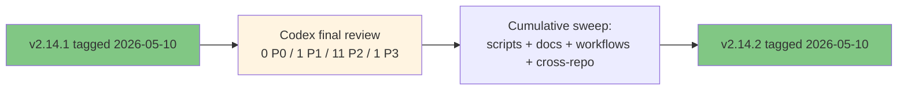

**Released**: 2026-05-10 (same day as v2.14.0 + v2.14.1)
**Type**: Patch release (cumulative docs hygiene)
**Skill count**: 40 (unchanged from v2.14.0)
**Key theme**: Codex final review closure

---

## TL;DR

v2.14.2 is a same-day cumulative patch that addresses every actionable finding from the Codex final adversarial review of the v2.14.x release cycle (run after v2.14.1 ship). The 40-skill catalog is unchanged; day-to-day usage of `/prd`, `/hypothesis`, `/user-stories`, and the rest of the catalog is identical to v2.14.1.

What changes is documentation accuracy, validator scope, workflow safety posture, and cross-repo metadata:

- **`validate-docs-frontmatter` scope expanded to .mdx** (parity with V6's `check-internal-link-validity` pattern). `src/content.config.ts` mounts both `.md` and `.mdx`, and `docs/index.mdx` is the Starlight homepage; without the scope expansion, frontmatter regressions on MDX surfaces silently bypass the validator.
- **`check-no-body-h1` doc clarified** with explicit "what is NOT caught (by design)" framing so future maintainers do not over-engineer it into a no-H1-anywhere rule.
- **`validate-mcp-sync` guide refreshed** to reflect the v2.14.x V9 + B changes (workflow default now `observe`; validator honors the `maintenance: true` flag in `pm-skills-source.json`).
- **`sync-agents-md.yml` workflow_dispatch hardened** with a two-layer defense: input gate (`apply: true` choice; default false) plus token gate (workflow-level `permissions: contents: read`, so the GITHUB_TOKEN cannot push even if the input gate is bypassed).
- **`pm-skills-mcp/README.md` cross-repo update**: 5 stale "25 skills" references corrected to "40 skills" with explicit catalog-frozen-at-v2.9.2-build framing; latest published version pointer updated to v2.9.3; changelog table extended with v2.8.x and v2.9.x rows.
- **`CONTRIBUTING.md` workaround count corrected** from "Five" to "Six" (matches the actual 6 numbered architectural-workaround entries, including the v2.14.1-added Starlight title-vs-body-H1 convention).
- **Release plan + Release_v2.14.0 deferral table reframed.** `plan_v2.14_starlight-migration.md` top status updated from "ready for execution kickoff" to "EXECUTED 2026-05-10". `Release_v2.14.0.md` "What's deferred to v2.14.x" table gains a Post-tag disposition column showing 6 of 9 deferrals closed in v2.14.1 + v2.14.2; 3 remain v2.15+ (tags-as-feature, URL slug normalization, Astro 6 upgrade).

For users: no behavioral change. The 40 skills, 47 commands, and 9 workflows are identical to v2.14.1.

For contributors: tighter validator coverage (frontmatter validation now scans .mdx), clearer rules-of-the-road for the body-H1 forward enforcement, safer manual-dispatch posture for the dormant `sync-agents-md.yml`, and accurate cross-repo metadata when reading the pm-skills-mcp README.

---

## What changed

The sweep was deliberately scoped to the Codex findings - no scope-creep refactors, no preemptive cleanup beyond what the findings called out, no new features.

### Codex finding closures

| Finding | Severity | Resolution |
|---------|----------|------------|
| pm-skills-mcp README v2.9.2 + "25 skills" stale | P1 | Updated to v2.9.3 + "40 skills"; catalog-frozen-at-v2.9.2-build framing added; changelog table extended |
| `validate-docs-frontmatter` scope omits .mdx | P2 | Added `\( -name "*.md" -o -name "*.mdx" \)` (bash) and `($_.Extension -eq ".md" -or $_.Extension -eq ".mdx")` (pwsh) following V6 pattern |
| `check-no-body-h1.md` ambiguous on rule scope | P2 | Added "What this rule does NOT catch (by design)" section with 3 explicit allowed cases |
| `docs/guides/validate-mcp-sync.md` says block-default | P2 | Reframed to observe-default with v2.14.x mode-history section and `maintenance: true` flag awareness |
| `sync-agents-md.yml` workflow_dispatch can still push | P2 | Two-layer defense: `apply: true` input gate + `permissions: contents: read` token gate |
| `plan_v2.14_starlight-migration.md` top status stale | P2 | "ready for execution kickoff" to "EXECUTED 2026-05-10 (Phases 0-4 + W13 sub-batches B1-B4 + B2.5/B3.5 mid-cycle insertions); post-tag cleanup (FU1-FU8 + M1-M3 + V1-V15 + A+B+C) shipped as v2.14.1; Codex-driven docs hygiene shipped as v2.14.2" |
| `Release_v2.14.0.md` deferrals table unchanged post-tag | P2 | Reframed "What's deferred to v2.14.x" table with Post-tag disposition column; 6 of 9 deferrals closed in v2.14.1 + v2.14.2; 3 remain v2.15+ |
| Other minor P2 findings | P2 | Folded into the same surfaces (release plan annotations + CHANGELOG `[Unreleased]` populated then promoted to `[2.14.2]`) |
| `CONTRIBUTING.md` says "Five workarounds" | P3 | Updated to "Six workarounds" (matches actual entry count after v2.14.1 added the Starlight title-vs-body-H1 entry) |

No P0 findings were surfaced (consistent with the W13 B3 mid-cycle Codex review of v2.14.0 release-state). The v2.14.x cycle has now passed two distinct Codex adversarial review passes with 0 P0 findings: B3 (pre-tag review of v2.14.0) and the post-v2.14.1 final review.

---

## What is NOT in v2.14.2 (deferred to v2.15+)

The three remaining v2.14.0-era deferrals stay on the v2.15+ backlog:

1. **Tags-as-feature.** Surfacing skill tags as a first-class navigation/filter dimension on the docs site (sidebar facets, tag landing pages). Not a regression; an enhancement waiting for design.
2. **URL slug normalization.** Several legacy URLs preserve mixed-case and dot characters from the MkDocs Material era (e.g., `Release_v2.14.0` rather than `release-v2-14-0`). Acceptable for now via redirect-table preservation; full normalization is a v2.15+ scope.
3. **Astro 6 upgrade.** Spike-confirmed feasible (W13 B3 review noted Astro 6 needs Node 22.12+; we pinned to Astro 5.13.x for the v2.14.0 cycle to avoid scope creep). Will revisit when there is a concrete reason (security advisory, dependency push, or breaking feature need).

---

## Migration / compatibility

- **No breaking changes.** Plugin manifests bumped 2.14.1 to 2.14.2; consumers on `npx skills add` or the plugin marketplace auto-pick up the new tag on next install/update.
- **CI behavior unchanged for contributors.** The `validate-docs-frontmatter` .mdx expansion adds `docs/index.mdx` to the validation set. Verified PASS on existing tree (37 files checked, 0 findings; previously 36 .md-only).
- **Workflow_dispatch on `sync-agents-md.yml`** is now a dry-run by default. Operators who manually dispatch it for testing the generation step will see the diff in the workflow log; the commit/push step will be skipped unless `apply: true` is explicitly selected. Even with `apply: true`, the workflow-level read-only token will refuse the push, requiring a code-review PR to re-enable write permission.

---

## Verification

- Local: bash + pwsh `validate-docs-frontmatter` PASS with .mdx in scope.
- Local: bash + pwsh `check-no-body-h1` PASS unchanged.
- Local: bash + pwsh `check-internal-link-validity` PASS unchanged.
- Local: Astro build PASS (125 pages; cold build time unchanged).
- CI: full `validation.yml` matrix passes on the v2.14.2 commit (Ubuntu + Windows).
- CI: `validate-plugin.yml` PASS on plugin manifest version bump.
- Production: `pm-skills-vX.X.X.zip` artifact regenerates with v2.14.2 metadata; GitHub Release auto-publishes from the annotated tag.

---

## Related

- v2.14.0 release notes: [`Release_v2.14.0.md`](Release_v2.14.0.md)
- v2.14.1 release notes: [`Release_v2.14.1.md`](Release_v2.14.1.md)
- Migration plan: [`docs/internal/release-plans/v2.14.0/plan_v2.14_starlight-migration.md`](https://github.com/product-on-purpose/pm-skills/blob/main/docs/internal/release-plans/v2.14.0/plan_v2.14_starlight-migration.md) (tracked under `docs/internal/release-plans/`; full execution log of the v2.14.x cycle)
- Cycle plan: [`docs/internal/release-plans/v2.14.0/plan_v2.14.0.md`](https://github.com/product-on-purpose/pm-skills/blob/main/docs/internal/release-plans/v2.14.0/plan_v2.14.0.md)
- CONTRIBUTING.md "Maintainer notes: architectural workarounds" section (6 entries; reviews the inline rationale future-maintainers should NOT "fix")
