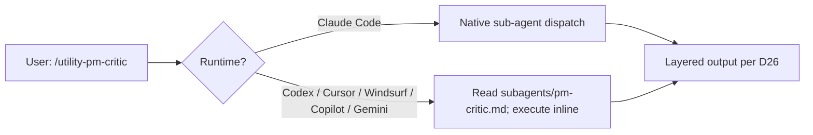

**Released**: 2026-05-17
**Type**: Minor release (new component class: sub-agents + Astro 6 doc-stack upgrade)
**Skill count**: 59 (was 55 at v2.15.0; +4 dispatch skills under classification: utility)
**New shipping unit**: sub-agent (Claude Code plugin component)
**Key themes**: Active Orchestration (first runtime-component layer) + Doc-Stack Modernization (Astro 6 + Node 22.12+ + Dependabot closure)

---

## TL;DR

pm-skills started as a content library: 55 skills + 62 slash commands + 12 workflows + 27 enforcing CI validators. Through v2.15.2 the AI reads, the AI acts, the AI produces. All of it is content.

v2.16.0 opens a second layer: **runtime components**. The first inhabitants are 4 Claude Code plugin sub-agents:

- **`pm-critic`** runs adversarial review on PM artifacts proactively (auto-fires after `/deliver-prd`, `/foundation-okr-writer`, and 11 other artifact-producing skills). Returns P0/P1/P2/P3 findings with concrete fix suggestions. **You can now run `/pm-critic` and get a real review in 30 seconds.**
- **`pm-skill-auditor`** runs a repo-wide cross-cutting governance audit invoking the full enforcing validator suite via `scripts/pre-tag-validate.{sh,ps1}` plus 14 cross-cutting checks plus aggregate counter re-derivation. **You can now run `/pm-audit-repo` for a pre-release governance check or repo-health audit.**
- **`pm-changelog-curator`** drafts CHANGELOG entries from `git log` applying `CLAUDE.md` hygiene rules (no internal-notes references, no em-dashes, public paths only). **You can now run `/pm-draft-changelog --since-tag vX.Y.Z` for a draft you can review and edit.**
- **`pm-release-conductor`** walks 6 explicit gates (G0, G1, G2, G2.5, G3, G4) with chain composition to auditor at G0 + G2.5 and curator at G2. Refuses to advance past failed gates; refuses to tag any SHA other than the G2.5-captured one. **You can now run `/pm-release v2.16.0` (or `--dry-run` to rehearse) for the full guided release flow.**

Cross-client compatibility is delivered via dispatch skills at `skills/utility-pm-{role}/` per master plan D30. On Claude Code, the dispatch skill invokes the native sub-agent. On non-Claude clients (Codex CLI, Cursor, Windsurf, Copilot, Gemini CLI), the dispatch skill reads the canonical sub-agent definition from `subagents/pm-{role}.md` and executes the system prompt inline.

The 4 dispatch skills ship **VALIDATED on Codex CLI 2026-05-17**: GATE B (3 non-conductor dispatch skills) and GATE C (conductor dispatch sub-spike with "reference + execute inline" chain composition) both PASSED. Evidence at [`docs/internal/release-plans/v2.16.0/gate-test-results_2026-05-17_codex.md`](../internal/release-plans/v2.16.0/gate-test-results_2026-05-17_codex.md). Re-runnable harness at [`maintainer-gate-testing-codex.md`](../internal/release-plans/v2.16.0/maintainer-gate-testing-codex.md) for users wanting to verify on a different non-Claude client.

The 55-skill catalog is unchanged. No new content skills. The new shipping unit is the sub-agent.

---

## What's New

### Sub-agents (4 new in v2.16.0)

The four sub-agents codify discipline the maintainer has been running manually since v2.11.0+:

| Sub-agent | Audience | Trigger | Replaces (manual practice) |
|---|---|---|---|
| `pm-critic` | User (PM) | Proactive after artifact skills + explicit `/pm-critic` | Phase 0 Adversarial Review Loop, run manually since v2.11.0; 2 review cycles in v2.15.0 (35 + 33 findings) |
| `pm-skill-auditor` | User + Maintainer | Explicit `/pm-audit-repo` | Pre-tag validator bundle + cross-cutting checks + counter audits, run manually each release cycle |
| `pm-changelog-curator` | Maintainer | Explicit `/pm-draft-changelog` or chained from conductor | CHANGELOG drafting by hand applying CLAUDE.md hygiene rules |
| `pm-release-conductor` | Maintainer | Explicit `/pm-release v{X.Y.Z}` | The full release runbook the maintainer follows each cycle |

Each sub-agent has a [behavioral spec doc](../internal/release-plans/v2.16.0/) (4 spec files) documenting the contract; the actual sub-agent definitions at [`subagents/`](https://github.com/product-on-purpose/pm-skills/tree/main/subagents) are referential (read canonical contract docs at invocation time per D12). Tools surface per agent:

- pm-critic: Read, Grep, Glob (no write; no Bash; no Agent)
- pm-skill-auditor: Bash, Read, Grep, Glob (Bash for validator invocation; detection-only)
- pm-changelog-curator: Bash, Read, Grep (Bash for git log; output is a draft, not an edit)
- pm-release-conductor: Bash, Read, Edit, Grep, Glob, **Agent** (Agent authorized via `subagents/_chain-permitted.yaml` allowlist; chain depth 2 max per D14)

### The 6-gate release runbook + G2.5 commit gate

The conductor walks 6 gates with explicit confirmation pauses. The critical addition is **G2.5 (Commit + re-verify)** between G2 and G3:

| Gate | Action | Chain |
|---|---|---|
| G0 | Pre-tag readiness (validators + em-dash sweep + counter audit) | Chains to auditor |
| G1 | Adversarial review status (maintainer attestation) | None |
| G2 | Version bump + CHANGELOG prep | Chains to curator |
| **G2.5** | **Commit release-prep edits; re-run G0; push for CI; capture SHA** | **Re-chains to auditor** |
| G3 | Tag annotated message + push (tags ONLY the G2.5-captured SHA) | None |
| G4 | Post-tag hygiene (P0 sub-checks block "Release complete") | None |

**Why G2.5 matters:** prior to v2.16, G2 edited release-prep files (plugin.json, marketplace.json, CHANGELOG.md, docs/changelog mirror, README badges, plan status, release notes) without committing. G3 then tagged "HEAD of the release branch." If the edits weren't committed, the tag pointed at a commit that did NOT contain the release metadata. The v2.13.1 plugin install path correction was a post-tag detection that required a fast patch ship; the same defect class can produce a broken tag in production. G2.5 closes the gap structurally by committing first, re-verifying, and capturing the SHA G3 tags. G3 refuses any other SHA.

This is one of v2.16.0's most important invariants: **the conductor's no-bypass property makes the broken-tag class of bug structurally impossible**. `--skip-gates` was deliberately removed per master plan D24 (closes Codex review R05). Maintainers who need to bypass a gate (e.g., G1 for a hotfix) must run that gate's verification manually and confirm at the gate prompt.

### Cross-client compatibility via dispatch skills

Sub-agents are a Claude Code plugin feature. Non-Claude clients (Codex CLI, Cursor, Windsurf, Copilot, Gemini CLI) cannot natively load `subagents/{name}.md` files. v2.16.0 delivers the same intent via **dispatch skills** at `skills/utility-pm-{role}/`:



The pattern is portable per agentskills.io: skills sync to per-client home directories; the dispatch skill detects its runtime and executes accordingly. The conductor's dispatch uses an expanded "reference + execute inline" pattern that inlines auditor + curator behaviors at G0 + G2 + G2.5 (because non-Claude clients cannot natively chain to other sub-agents).

**The single-tool user assumption (master plan D30):** users pick ONE primary AI tool. pm-skills does NOT assume users run multiple tools simultaneously. The dispatch skill mechanism delivers full functional value to that one tool. codex-rescue is an optional shortcut for users with both Claude Code AND Codex CLI; it is NOT a baseline requirement.

### 10 new public documentation files

- [`docs/concepts/sub-agents.md`](../concepts/sub-agents.md) - what sub-agents are, how they differ from skills, the v2.16.0 slate, composition patterns, cross-client compatibility, when-to-use guidance
- [`docs/concepts/active-orchestration.md`](../concepts/active-orchestration.md) - strategic theme explainer; what changes for users; v2.16-v2.18 roadmap arc with mermaid gantt diagram
- [`docs/guides/using-sub-agents.md`](../guides/using-sub-agents.md) - quick reference, 4 invocation patterns, cross-client paths, maintainer operations, 4 common workflows, troubleshooting
- [`docs/guides/adversarial-review.md`](../guides/adversarial-review.md) - pm-critic deep dive with severity grammar worked examples (PRD, OKR, recap, persona), skill-revise-recheck loop with mermaid flowchart, 3 opt-out paths
- [`docs/contributing/release-runbook.md`](../contributing/release-runbook.md) - canonical 6-gate runbook the conductor reads at invocation time; manual-mode usable; includes mermaid flowchart of 6-gate sequence with universal failure exit + bypass-refusal cycle
- [`docs/contributing/authoring-sub-agents.md`](../contributing/authoring-sub-agents.md) - file structure + frontmatter convention + referential discipline + companion command pairing + dispatch skill pattern + 16-item validation checklist
- [`docs/contributing/sub-agent-design-patterns.md`](../contributing/sub-agent-design-patterns.md) - 4 invocation patterns + 4 composition patterns with mermaid sequence and flowchart diagrams; decision tree for new sub-agents
- [`docs/contributing/ci-overview.md`](../contributing/ci-overview.md) - map of all 9 GitHub Actions workflows + ~30 validator scripts; trigger -> workflow -> validator -> outcome flowchart; how-to-add-a-new-validator guide; failure-triage pointers
- [`docs/reference/runtime-components.md`](../reference/runtime-components.md) - canonical catalog of sub-agents (rows populated for all 4) + hooks (empty; v2.17+) + output styles (empty; v2.18+) + Cross-Client Compatibility section
- [`docs/reference/sub-agent-compatibility.md`](../reference/sub-agent-compatibility.md) - canonical cross-client compatibility matrix; Claude Code / Codex CLI / Cursor / Windsurf / Copilot CLI / Gemini CLI status per sub-agent; safe-usage matrix; v2.17 expansion plan; how-to-validate-a-new-client maintainer guide

### Library samples

12 thread-aligned samples (3 per sub-agent across brainshelf / storevine / workbench narrative threads). Each sample is real (not staged):

- pm-critic: Brainshelf PRD review (7 findings); Storevine OKR refusal-protocol catches (6 findings); Workbench meeting recap with family-contract checks (5 findings)
- pm-skill-auditor: Brainshelf mid-cycle audit (5 findings; in-cycle drift); Storevine aggregate-counter drift detection (canonical v2.12.0 defect class); Workbench skill-without-command + command-without-skill (cross-cutting symmetry)
- pm-changelog-curator: Brainshelf v2.16.0 minor release draft; Storevine v2.16.1 patch release shape; Workbench v2.17.0 multi-track feature release shape
- pm-release-conductor: Brainshelf clean-run (all 6 gates PASS first try); Storevine G0 aggregate-counter-drift failure + maintainer recovery; Workbench chained dry-run (auditor + curator chain composition)

Catalog at [`library/sub-agent-samples/README.md`](https://github.com/product-on-purpose/pm-skills/tree/main/library/sub-agent-samples).

### `subagents/` directory rename (master plan D31)

The Claude Code plugin convention is `agents/` (lowercase) at the plugin root for sub-agent definitions. pm-skills already has an `AGENTS/` directory (uppercase) for agent-coordination context (claude/, codex/, DECISIONS.md). On case-insensitive filesystems (Windows NTFS, macOS APFS) these collide.

Plugin.json supports a custom `"agents"` field that overrides the default. v2.16.0 ships with `"agents": ["./subagents/"]` so Claude Code discovers sub-agents at the non-colliding `subagents/` path. The existing `AGENTS/` directory stays unchanged. Cross-platform clean; no NTFS hackery required.

This was a Phase 1 Task 1 execution-time finding (the planning session didn't catch it because Windows + git config core.ignorecase=true silently masked the collision until the first `mkdir agents` attempt). D31 was added to the Ratified Decisions table during the session; D4 was amended in place pointing to D31. See master plan for the full Decision Brief.

### Validator extension

`scripts/validate-agents-md.{sh,ps1}` extended to enumerate `subagents/*.md` files and verify each agent name appears at least once in AGENTS.md. Name-based check per master plan D5 + D12 (AGENTS.md references sub-agents by name; runtime-components.md is the canonical detail catalog). The existing skills/* path-based scan is unchanged. New validator output:

```
OK: AGENTS.md matches 59 skill paths
OK: AGENTS.md references 4 sub-agents
```

---

## What's deferred

The v2.16.0 plan slate included carry-forward items deferred to v2.17:

### 5 nice-to-have CI validators

Deferred to v2.17 per ci-plan rationale:

- `check-runtime-components-sync` - verify runtime-components.md table rows match subagents/ directory
- `check-sub-agent-command-pair` - verify every sub-agent has companion command per _pairing.yaml
- `check-em-dashes` canonical - replaces perl one-liners used during v2.16 authoring
- `check-aggregate-counters` as extension of check-landing-page-counts
- Chain-permitted allowlist HARD FAIL enforcement (currently MANUAL CHECK at pre-tag)

### Repo hygiene sweeps

CONTEXT.md final refresh, `_working/` archive sweep of superseded planning docs, DS family validator metadata-shape strict promotion, backlog-canonical.md refresh, completed F-XX effort docs archive, TODO/FIXME inventory. All deferred to pre-tag artifact pass + v2.17 cleanup per natural sequencing (CONTEXT.md refresh runs LAST per Codex R13).

### v2.17.0 stub created

[`docs/internal/release-plans/v2.17.0/plan_v2.17.0.md`](../internal/release-plans/v2.17.0/plan_v2.17.0.md) captures all carry-forward items plus v2.17 candidate sub-agents (pm-workflow-orchestrator, pm-frontmatter-doctor, AI-Native PM Pack), content gap skills, hook infrastructure, and user-settings parser.

---

## Cross-client validation results

> For the canonical cross-client status that updates as new clients are validated, see [Sub-Agent Compatibility Matrix](../reference/sub-agent-compatibility.md). This section captures v2.16.0 ship-state evidence.

The 4 dispatch skills at `skills/utility-pm-{role}/` were validated on Codex CLI 0.128.0 on 2026-05-17 via the self-administering harness at [`docs/internal/release-plans/v2.16.0/maintainer-gate-testing-codex.md`](../internal/release-plans/v2.16.0/maintainer-gate-testing-codex.md):

- **GATE B** (3 non-conductor dispatch skills): PASS. pm-critic produced 7 findings against the Brainshelf PRD sample matching the canonical output shape. pm-skill-auditor invoked the validator suite + cross-cutting checks + counter audit successfully. pm-changelog-curator drafted entries from git log applying CLAUDE.md hygiene rules with zero violations + dirty-tree refusal working correctly.

- **GATE C** (conductor dispatch sub-spike): PASS. The "reference + execute inline" pattern for chain composition held through all 6 gates (G0/G1/G2/G2.5/G3/G4) in a single Codex CLI context window. Inlined auditor + curator produced valid layered output. Context budget held. No-bypass refusal worked. Dry-run framing correct.

**Outcome:** Codex-scoped Option A. Dispatch mechanism validated on ONE non-Claude client (Codex CLI). Master plan D30 updated.

**Important scope caveats** (per the 2026-05-17 Codex adversarial pass that challenged premature ratification):

- **Codex CLI dispatch:** validated in dry-run mode for all 4 dispatch skills. Production-ready for the 3 non-conductor dispatch skills (pm-critic, pm-skill-auditor, pm-changelog-curator). The conductor dispatch + LIVE release operations on Codex CLI is use-with-caution: the dry-run validated chain composition + gate logic, but actual `git tag` + `git push` operations via the dispatch path were simulated, not executed.
- **Cursor / Windsurf / Copilot CLI / Gemini CLI:** UNTESTED in v2.16.0. The dispatch mechanism is expected to work based on agentskills.io portability claims (each client supports the file-read + treat-content-as-instructions pattern that the dispatch skill depends on), but no maintainer has independently confirmed. Treat as EXPERIMENTAL on these clients.
- **Live release on any non-Claude client via the conductor:** the no-bypass + only-tag-G2.5-captured-SHA invariants apply, so the worst-case failure mode is bounded. Still, maintainers wanting belt-and-suspenders confidence should re-run the harness on their preferred client first.

Maintainers wanting to add validation evidence for a specific non-Claude client can re-run the same harness at `maintainer-gate-testing-codex.md`; it is structured for autonomous execution + one-paste result hand-off back to Claude. Cross-client validation results land in v2.17 release notes as they accumulate.

Full evidence + per-test results: [`gate-test-results_2026-05-17_codex.md`](../internal/release-plans/v2.16.0/gate-test-results_2026-05-17_codex.md).

---

## Upgrade notes

**Day-to-day usage is unchanged.** The 55-skill content catalog is identical to v2.15.2. All existing slash commands (`/prd`, `/hypothesis`, `/user-stories`, etc.) work exactly as before. Workflows unchanged.

**New surface to discover:** 4 sub-agent slash commands (`/pm-critic`, `/pm-audit-repo`, `/pm-draft-changelog`, `/pm-release`) and 4 dispatch skills accessed via `/utility-pm-{role}` on non-Claude clients.

**No breaking changes.** No removed skills, no removed commands, no removed validators. Existing CI workflows pass without changes.

**Plugin installation:** users on Claude Code who already have pm-skills installed will pick up the new sub-agents on next plugin refresh. The plugin.json's custom `agents` field declaration means Claude Code reads from `subagents/` not the default `agents/` path; this is automatic and requires no user configuration.

---

## Cross-References

- Master plan: [`docs/internal/release-plans/v2.16.0/plan_v2.16.0.md`](../internal/release-plans/v2.16.0/plan_v2.16.0.md) (31 ratified decisions D1-D31)
- Sub-agents integration plan: [`subagents-integration-plan.md`](../internal/release-plans/v2.16.0/subagents-integration-plan.md) (all 8 phases COMPLETE)
- Maintainer test handoff: [`maintainer-gate-testing.md`](../internal/release-plans/v2.16.0/maintainer-gate-testing.md)
- Behavioral specs: [`spec_pm-critic.md`](../internal/release-plans/v2.16.0/spec_pm-critic.md), [`spec_pm-skill-auditor.md`](../internal/release-plans/v2.16.0/spec_pm-skill-auditor.md), [`spec_pm-changelog-curator.md`](../internal/release-plans/v2.16.0/spec_pm-changelog-curator.md), [`spec_pm-release-conductor.md`](../internal/release-plans/v2.16.0/spec_pm-release-conductor.md)
- Adversarial review Phase 0 closure: 7 findings (3 P1 + 4 P2; all addressed) per Codex session reviewing the v2.16.0 ship state
- v2.15.2 predecessor: [`Release_v2.15.2.md`](./Release_v2.15.2.md)
- Next: v2.17.0 stub at [`docs/internal/release-plans/v2.17.0/plan_v2.17.0.md`](../internal/release-plans/v2.17.0/plan_v2.17.0.md)
