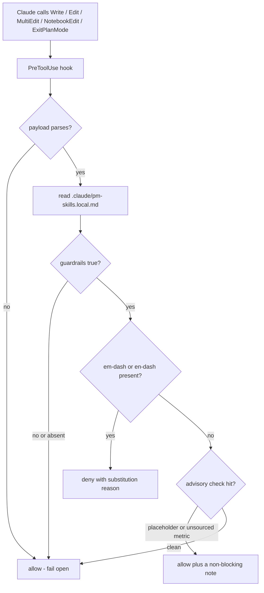
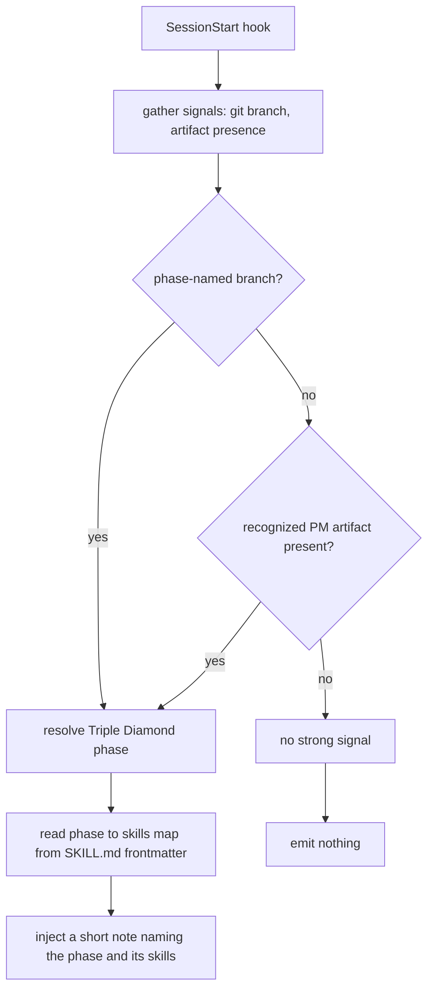
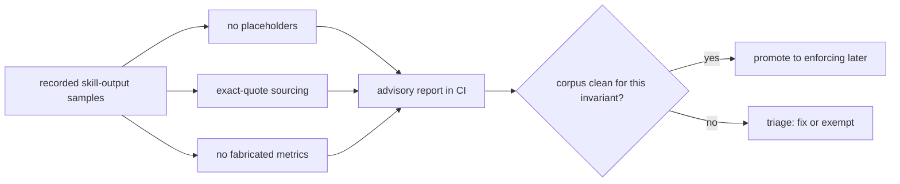

## The short version

v2.25.0 wires the existing 65 skills into Claude Code's platform, rather than adding more skills. It ships the plugin's first three pieces of activation-and-trust machinery:

- **Opt-in house-rule guardrails** (a `PreToolUse` hook) that block banned characters at write time, but only when you ask for them.
- **A confident-only phase router** (a `SessionStart` hook) that points you at the right Triple Diamond skills for where you are, and stays quiet when it is not sure.
- **An advisory output-quality CI tier** that checks the recorded skill samples for quality invariants, not just structure.

No new skills: the catalog stays at 65, and sub-agents stay at 5. This is an additive minor release; nothing existing changed.

## Guardrails: enforce your house rules, only when you opt in

The repo has a hard editorial rule (no em-dash or en-dash characters). Until now that rule was persuasion: a note in `CLAUDE.md`. F-43 makes it enforceable and, crucially, distributable, without imposing it on anyone who did not ask.

The hook is **off by default**. Installing pm-skills changes nothing about how Claude writes. To switch it on for a project, add a gitignored `.claude/pm-skills.local.md`:

```yaml
---
guardrails: true
guardrail_checks: [em-dash, placeholder, fabricated-metric]
---
```

With it on, em-dash and en-dash are blocked at the moment Claude tries to write them (Claude gets the substitution reminder and self-corrects); placeholder and metric checks warn but never block. Everything fails open: any error, missing file, or malformed config lets the write through, so a hook bug can never block your unrelated work.



## Phase router: the right skill, only when it is sure

With 65 skills, the hard part is knowing which to invoke when. F-44 inspects cheap repo signals at session start and, when one is strong, suggests the skills for that Triple Diamond phase. The design rule is calibrated silence: a router that guesses out loud becomes noise, so this one says nothing unless a signal is strong.

It reads two signals: a phase-named git branch (`discover/...`, `define/...`, `develop/...`, `deliver/...`, `measure/...`, `iterate/...`), or a recognized PM artifact present in the repo. On a strong signal it injects a short note for Claude naming the phase and a few relevant skills. On no signal it stays completely silent.



Both hooks are authored in Node and are dependency-free, so they run on any machine where Claude Code runs.

## Output-quality eval harness (advisory)

Every CI check so far has answered a structural question: does a file exist, parse, match a count, resolve a link. Nothing checked whether a skill produces good output. M-30 adds the missing quality axis, cheaply, by checking invariants over the sample outputs the repo already ships.



All three run advisory (they never fail a build today). Two are already clean on the corpus (no-placeholders, exact-quote-sourcing) and are candidates to become enforcing; the third (no fabricated metrics) is a heuristic that flags percentages for human review and stays advisory.

## Do I need to do anything?

No. The guardrails are off until you opt in, and the router only speaks when it is confident. Everything you already use behaves exactly as before. If you want the editorial enforcement in a project, drop a `.claude/pm-skills.local.md` with `guardrails: true`.

## FAQ

**Does the guardrail hook block my own typing?** No. Hooks fire on Claude's tool calls, not on what you type by hand. It only ever gates writes Claude is about to make.

**Will the router nag me on every session?** No. It is silent unless a repo signal is strong (a phase-named branch or a recognized artifact). On a generic repo it says nothing.

**Do these work outside Claude Code?** Hooks are a Claude Code primitive, so the guardrails and router are Claude Code features. The portable surface across clients remains the skills themselves.

**Versioning:** this is a minor release. It adds capability (hooks and a CI tier), not content; nothing existing was removed or changed in behavior.
