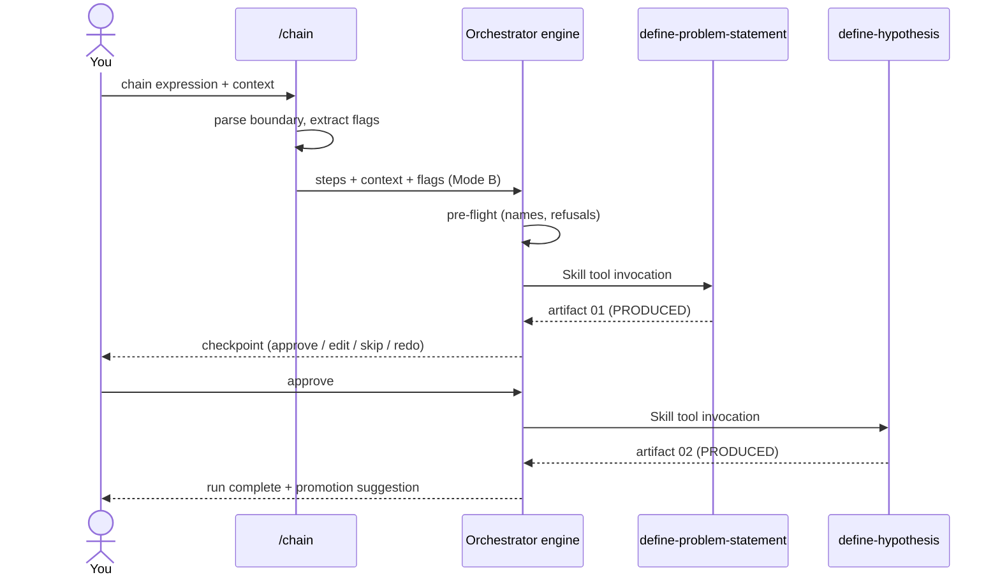

**Released 2026-06-10.** Additive MINOR. Catalog grows 65 to 66 skills (utility 11 to 12); command files 10 to 11; sub-agents stay at 5; workflows stay at 12.

## The short version

Three things, in plain language:

- **`/chain` runs any sequence of skills, right now.** Type the skills in order, add your context, and the orchestrator runs them one at a time, pausing for your go/no-go between steps. Nothing is saved or committed; it is for the sequence you need today.
- **`utility-pm-workflow-builder` makes a good sequence permanent.** When a chain proves itself, the builder walks you from "this worked" to a complete draft workflow (the file, the command, and the promotion checklist), staged for review. Try it ad hoc, keep what works.
- **All 26 older skills got honest boundaries.** Every skill from the original generation now says when NOT to use it (and which neighbor to use instead) and exactly what a complete output contains. Nothing about how the skills work changed; they are just much harder to fire by mistake.

And one thing about trust: the engine path under `/chain` was **live smoke-tested on the installed plugin before this release**, with the result recorded either way. It passed. Details below, including the caveats.

## Try a sequence, keep what works

The release closes a loop that used to require authoring a workflow file before you could test whether the sequence was even useful:

```mermaid
flowchart LR
    A["/chain<br/>(run it once, ephemeral)"] --> B["pm-workflow-orchestrator<br/>Mode B engine"]
    B -->|"completed 2+ step chain:<br/>promotion suggestion"| C["utility-pm-workflow-builder<br/>(staged draft packet)"]
    C -->|"human review + promote"| D["_workflows/ file +<br/>workflow command (durable)"]
    D -->|"from then on"| E["curated /workflow-* command"]

    style A fill:#e7f5ff,stroke:#1971c2,color:#0c2d5e,stroke-width:2px
    style B fill:#f3e8ff,stroke:#7048e8,color:#3a1d8a,stroke-width:2px
    style C fill:#fff4e1,stroke:#d9480f,color:#5e2200,stroke-width:2px
    style D fill:#e6fcf5,stroke:#0ca678,color:#0a4f3c,stroke-width:2px
    style E fill:#e6fcf5,stroke:#0ca678,color:#0a4f3c,stroke-width:2px
```



### `/chain`: the ad-hoc runner

```
/chain define-problem-statement -> define-hypothesis Mobile checkout drop-off spiked 18 percent after the March redesign
```

That is the whole interface: skills in order (`,` and `->` both work as separators), then your context. Flags go anywhere: `--dry-run` previews the run without executing anything, `--auto` runs without pausing on clean steps, `--thread` declares that each step should consume the previous step's artifact.

For the engineers, the design is deliberately thin:

- **The command parses only the boundary.** The chain expression is exactly the separator-joined list; it ends at the first name not followed by a separator, and everything after that is context, even when the context words look like skill names. A trailing separator is a refusal, never a guess.
- **The engine owns everything else.** Name validation (exact match, suggestions offered but never substituted), Tier-3 maintenance refusals, self-reference refusal, checkpoint semantics, and the PRODUCED / EMPTY / FAILED step rubric all live in the `pm-workflow-orchestrator` engine that shipped in v2.24.0. `/chain` added no new engine and no new skill.
- **The grammar is written down once**, as the Mode B Chain Expression Contract in `skills/utility-pm-workflow-orchestrator/references/PARSE-CONTRACT.md`. The command, the engine, and the new builder all reference that one section.

A live run looks like this:



### `utility-pm-workflow-builder`: from chain to durable workflow

The 66th skill. Hand it a promoted chain expression (the orchestrator suggests this after any successful 2+ step run), a list of skills, or just "I need a workflow for quarterly business reviews," and it walks five steps: understand the idea, overlap analysis against every existing workflow (with a Why Gate and a kill gate at greater than 70 percent overlap), sequence design with authored handoffs, packet generation, and review guidance.

What makes it safe to hand to contributors:

- **It writes only to a gitignored staging area** (`_staging/workflows/<name>/`); promotion to canonical paths is always a human act.
- **It applies the same name-safety contract as the engine** at authoring time, and refuses maintenance skills, dispatch skills, and workflows as steps.
- **The packet's checklist names every surface a new workflow trips**, including the one no validator can see: the GitHub release-note template inside `release.yml` is YAML, and the count validators scan only markdown and JSON, so the emitted checklist is the only control that keeps generated release notes truthful when a workflow is promoted. That row exists because an adversarial review found the gap and a third pass found that future promotions would reintroduce it.
- It ships with a complete worked example (a quarterly-business-review workflow) and three thread samples showing realistic packets, including one where the Why Gate fires against an overlapping workflow and passes on specific evidence.

## Every older skill now knows when not to fire

The quality-convergence effort (F-12) brought all 26 skills from the original January generation up to the floor the newer skills established. Per skill, exactly three kinds of additive edits:

1. A **"When NOT to Use"** section with boundary pointers to the right neighbor ("You need the customer-facing announcement of what shipped: use `deliver-release-notes`").
2. An **output contract that enumerates the template sections** a complete artifact fills, so "done" is checkable rather than implied.
3. **Untestable checklist lines rewritten to verifiable ones** (four total across the cohort; "tone is positive and professional" became a checkable jargon-leak test).

What deliberately did NOT change: no working instructions were rewritten, no templates or examples were touched, no behavior changed, and no two skills were merged. Convergence here means converging on a shared quality floor, not converging skills into each other.

| Batch | Cohort | Skills | New versions |
|---|---|---|---|
| 0 | Description integrity + scar hygiene | 14 skills (collision pairs de-embedded, one phantom reference removed, dispatch descriptions trimmed) | patch bumps |
| 1 | Deliver | 6 | 2.1.0 (acceptance-criteria 1.1.0) |
| 2 | Define + Develop | 8 | 2.1.0 |
| 3 | Discover + Iterate | 7 | 2.1.0 |
| 4 | Measure + persona | 5 | 2.1.0 (persona 2.6.0) |

Every bumped skill now carries a `HISTORY.md`. The five newest phase skills, the 2026-04+ foundation skills, and the utility and tool families were out of scope by design: they set the standard the rest converged to.

## Why you can trust the engine path (and where caution remains)

Since v2.24.0, the orchestrator has been the only component that delegates to other skills through the `Skill` tool, and that mechanism had never been confirmed on a real installed plugin. This release made the test a recorded evidence gate: it had to run before the tag, and a failure would have shipped too, disclosed, with the EXPERIMENTAL label kept.

It ran on 2026-06-10 against the installed plugin, headlessly, and **passed both legs**: the dry run exercised the parse boundary, pre-flight checks, and refusals; the live run produced two real artifacts on disk with the checkpoint pause honored. The mechanism question is answered: the engine invokes downstream skills via the `Skill` tool, and they execute **inline in the engine's context** (the Skill tool injects the skill's instructions; no nested sub-agent is spawned), which is exactly the architecture the engine's disk-write design assumes.

Status after the gate, honestly labeled:

| Path | Status |
|---|---|
| Claude Code native, Mode B chains (`/chain`) | Smoke-tested PASS (2026-06-10) |
| Claude Code native, Mode A (saved plan runs) | EXPERIMENTAL (mechanism proven, mode not yet exercised) |
| Non-Claude clients (Codex CLI, Cursor, Windsurf, Copilot, Gemini) | EXPERIMENTAL (inline branch, unchanged) |

Recorded caveats: the headless checkpoint resume re-instantiated the engine with carried run state (correct, but a continuous interactive engine across many checkpoints is a separate exercise), and `--dry-run` first remains the recommended habit. The full record, including an environment quirk the run surfaced, lives in the [Sub-Agent Compatibility Matrix](../reference/sub-agent-compatibility.md). The procedure itself is now a repeatable runbook: [Agentic Smoke-Test Runbook](../contributing/agentic-smoke-runbook.md).

## Also in this release

- **The docs front door stopped rotting.** The homepage's per-family skill cards are now enforced by CI against the filesystem (every card count must match, and the cards must sum to the catalog total); the audit that found them quietly stale also produced fixes to `AGENTS.md` (eight dead references repaired) and a marketplace-first `QUICKSTART`.
- **The em-dash-scar guard now covers `skills/`**, after a sweep of 56 files, so the class cannot return in the content agents actually read.
- **Validator docs caught up with reality** (the workflow-coverage checker no longer cites a retired Python generator).
- `utility-pm-workflow-orchestrator` is 1.1.0: the `--thread` flag is named, completion output suggests promotion, and its always-loaded description was rewritten to lead with triggers.

## Install or upgrade

```bash
# Claude Code (marketplace)
/plugin marketplace add product-on-purpose/agent-plugins
/plugin install pm-skills@product-on-purpose

# any agent, via the open skills CLI
npx skills add product-on-purpose/pm-skills
```

Existing installs: update the marketplace and reinstall to pick up v2.26.0. Nothing existing was removed or renamed; this is an additive minor.
