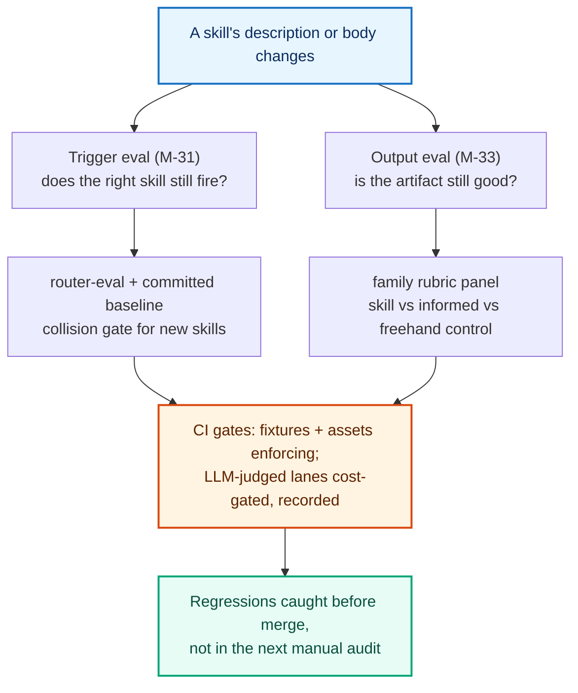

**Released 2026-06-15.** Additive MINOR. No new skills (catalog stays 66; 5 sub-agents, 11 commands, 12 workflows). This release adds the machinery that makes skill quality measurable and keeps it from regressing.

## The short version

After v2.26.0 made every skill state when to use it, v2.27.0 makes those claims **verifiable** rather than asserted. Three things, in plain language:

- **Every skill now has trigger-eval fixtures, and routing regressions fail CI.** Each measured skill ships a labeled set of "should fire" / "should not fire" queries (including near-misses aimed at its closest neighbors). A controlled router eval scores which skill a query routes to, and a committed baseline + a new collision gate mean a description edit that starts stealing a neighbor's queries is caught automatically instead of in the next hand audit.
- **The catalog surfaces are generated, not hand-synced.** `skill-manifest.json` (a machine-readable catalog of all 66 skills) and the `AGENTS.md` skills section are now generated from each skill's frontmatter and held current by enforcing CI staleness gates. The hand-sync drift class - stale counts and descriptions - is gone before the catalog grows again.
- **New skills ship eval-ready.** The skill builder now scaffolds the eval assets (trigger fixtures, an output-quality scenario, reciprocal boundary pointers) and the validator checks them, so coverage can never fall behind the catalog.

Nothing about how the skills produce their artifacts changed. This is the quality *infrastructure* under them.

## Provable quality: the two eval layers

The published agentskills.io standard defines two eval layers - does the right skill *fire*, and is the artifact it produces *good*. v2.27.0 builds both, with the deterministic asset gates enforcing in CI and the LLM-judged lanes recorded as the evidence (cost-gated, never blocking a normal push):



### Trigger accuracy (M-31): routing is now measured

- **Fixtures for the full measured roster** - 29 skills (the v2.26.0 quality-convergence cohort plus collision partners) each carry an `evals/trigger-fixtures.json` with labeled queries (should-trigger, should-not, near-miss negatives aimed at known neighbors) in the published 60/40 train/validation format. 580 labeled queries in all.
- **A controlled router eval** (`scripts/run-router-evals.mjs`) is the trustworthy instrument: it asks a model which single skill a query routes to given every skill's description, and scores per-skill recall and precision. Because it is a direct API call with no plugin environment, it isolates the description under test, runs cheaply and in parallel, and includes a built-in calibration self-check.
- **Three CI gates** keep it honest: a deterministic fixture-shape validator (enforcing), a committed-baseline drift lane that fails on any recall/precision regression, and a new-skill collision gate that fails if an added skill steals a neighbor's queries or false-fires on its near-misses. The LLM-judged lanes are cost-gated and dispatch-run; the recorded baseline is the evidence.

### Output quality (M-33): the gates ship; the harness is honest

The output-eval program ships its **gates and tooling** (the per-skill results stay internal evidence). The harness generates a skill's artifact and scores it blind against a family rubric, and it is built to refuse to fool itself: it fails closed on a partial judge panel, and an absolute-failure-first verdict means a weak control can never launder a genuinely bad skill into a pass. A third "informed control" arm (which receives the skill's template but not its instructions) separates a skill's *structural* value from its added *rigor*. The deterministic asset-presence gate (every output scenario has valid frontmatter mapping to an existing family rubric) is wired in CI.

## Generated surfaces (M-32): no more hand-sync drift

`skill-manifest.json` is a new generated, committed catalog of all 66 skills - name, verbatim description, version, group, family, references, sample path, plus aggregate counts - built from frontmatter by `scripts/gen-skill-manifest.mjs`. The `AGENTS.md` skills catalog is now generated between markers from the same source. Both are held current by enforcing CI staleness gates (the generate-plus-`--check` pattern), and the disabled legacy `sync-agents-md.yml` workflow is retired. First generation resynced descriptions that had drifted from frontmatter, including the v2.26.0 boundary-pointer rewrites the hand-maintained catalog never received.

## New skills ship eval-ready (creator integration)

The creator/validator family now bakes the eval contract into skill creation:

- **`utility-pm-skill-builder` 1.1.0** gains an Eval Readiness step (name the new skill's nearest neighbors, require reciprocal "When NOT to Use" pointers, assign an output-eval family rubric) and scaffolds the eval assets - `evals/trigger-fixtures.json` and an output scenario - into the packet, with the new-skill collision probe run at promotion.
- **`utility-pm-skill-validate` 1.1.0** reports on eval readiness: new structural checks for trigger-fixture presence, output-scenario presence, and reciprocal-boundary-pointer symmetry (a one-directional declared collision pair fails).
- **The reciprocity gate is enforcing.** `check-reciprocal-boundary-pointers.mjs` asserts every declared collision pair cross-points in both skills' "When NOT to Use"; the one real gap it found is closed.
- **CONTRIBUTING** documents the eval contract as part of "what done looks like" for a new skill.

## Also in this release

- **`deliver-edge-cases` 2.1.1** - a trigger-recall patch adding intent-synonyms (failure modes, what can go wrong, race conditions, boundary scenarios) so the skill is recognized when its domain is phrased without the literal words "edge case."
- **`foundation-meeting-recap` 1.0.2** - the reciprocal "When NOT to Use" body pointer to `discover-interview-synthesis` that let the reciprocity gate promote to enforcing.
- **A skill-versioning policy clarification** - tooling-only files added beside a skill (eval fixtures, test artifacts) do not bump the skill's version.

## Install or upgrade

```bash
# Claude Code (marketplace)
/plugin marketplace add product-on-purpose/agent-plugins
/plugin install pm-skills@product-on-purpose

# any agent, via the open skills CLI
npx skills add product-on-purpose/pm-skills
```

Existing installs: update the marketplace and reinstall to pick up v2.27.0. Nothing existing was removed or renamed; this is an additive minor.
