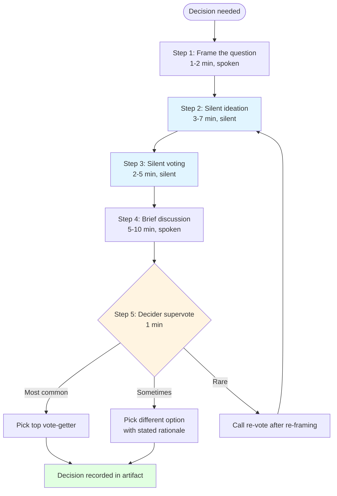

<!-- PM-Skills | https://github.com/product-on-purpose/pm-skills | Apache 2.0 -->

# Note-and-Vote

Run a structured group decision in 20-30 minutes. Silent contribution surfaces independent thinking before group dynamics narrow the option space; explicit Decider supervote closes the choice. Produces a written audit trail of the decision and the alternatives considered.

## When to Use

- A small team (3-10 people) needs to make a fast decision with diverse input.
- Groupthink, status bias, or loudest-voice dominance is a real risk.
- A workshop or meeting moment demands silent ideation before open discussion.
- The decision needs an audit trail (what was considered, why the chosen option won).
- Decision authority is clear (a Decider exists and is in the room or available).
- Used heavily across Foundation Sprint and Design Sprint at decision moments.

## When NOT to Use

- A single person owns the decision and just needs to make it. Use direct judgment.
- Consensus has already emerged organically. The voting overhead adds friction without value.
- The decision is high-stakes enough to warrant longer deliberation (multi-day investigation, written proposals, formal review). Note-and-Vote is a 25-minute tool, not a governance process.
- No Decider is available and the team has no authority to close the decision themselves. Defer until a Decider can attend.

## The Five-Step Protocol

```text
1. Frame the question (1-2 min)
2. Silent ideation (3-7 min, depending on complexity)
3. Silent voting (2-5 min, multi-vote or single-vote)
4. Brief discussion of the vote distribution (5-10 min)
5. Decider supervote (1 min)
```

Total: 12-25 minutes depending on time allocations. Default is 25 minutes for a non-trivial decision.



Silent steps (blue) protect against anchoring. The Decider supervote (amber) has three legal outcomes; the loop back to silent ideation is the recovery path when the framing was wrong.

### Step 1: Frame the question

Write the decision question on the board, one sentence, unambiguous. Examples:

- "Which target customer segment should our Foundation Sprint commit to for Day 1?"
- "Which solution sketch goes forward into Wednesday's storyboard?"
- "Which sprint question should be the primary scorecard row on Friday?"

Bad framings to avoid:

- Compound questions ("which customer AND problem")
- Yes/no questions (use a different tool)
- Open exploration ("what should we do?")

### Step 2: Silent ideation

Every participant contributes options silently and independently. Sticky notes on a wall, cells in a Miro board, or rows in a shared doc. No talking. No reading others' contributions until the timer ends.

The facilitator MUST enforce silence. Verbal contribution defeats the purpose.

### Step 3: Silent voting

Display all contributions anonymously (or with attribution if the team has agreed). Each participant gets N votes (often 2-3 for a multi-vote round, 1 for a single-vote tiebreaker). Vote silently using dots, stickers, reactions, or numbers. No discussion during voting.

### Step 4: Brief discussion

Surface the top 2-3 vote-getters. Each person who voted for the top options briefly explains why. The facilitator times this (5-10 minutes max). If discussion expands beyond the top options, the facilitator pulls it back.

This is the place where the team can detect surprises ("I didn't realize we were aligned on X") or unsurprises ("we're split between A and B for known reasons"). It is not the place to relitigate the framing.

### Step 5: Decider supervote

The Decider names the chosen option. The Decider may pick the top vote-getter (most common), pick a different option with stated rationale (sometimes), or call for a re-vote after the discussion (rare).

The supervote is the decision. Record it explicitly in the artifact. Do not let the supervote blur into continued discussion; the team needs to see the close.

## Output Structure

The skill produces a single bundled artifact containing:

1. The decision question (verbatim)
2. The silent ideation board (all contributions, timestamped, attribution per team agreement)
3. The vote summary (counts per option, voters per option if attribution agreed)
4. Discussion notes (brief, the rationale that surfaced)
5. The decision record (chosen option + Decider name + Decider rationale if non-obvious)

See `references/TEMPLATE.md` for the canonical structure and `references/EXAMPLE.md` for a worked example using the Brainshelf book-catalog Foundation Sprint thread.

## Common Pitfalls

- **Skipping silent ideation.** "Let's just discuss it" defeats the protocol. The team produces what they would have produced without the tool.
- **Skipping Decider supervote.** Consensus drift. The discussion ends without a recorded decision.
- **Long discussion phase.** Five-minute discussions become twenty-minute debates. The facilitator must time-box and pull back.
- **Compound or vague framing.** "What should we do about X?" is not a decidable question. Reframe before invoking.
- **Voting without seeing the contributions.** If contributions are revealed during ideation, the voting is anchored to the first idea seen. Enforce silence.
- **Treating the Decider's choice as advisory.** The supervote is the decision; if the Decider does not have authority, the wrong person is in the Decider seat.

## Decider Role

The Decider has three responsibilities in Note-and-Vote:

1. **Frame the question** (or approve the facilitator's framing) before silent ideation begins.
2. **Listen during discussion** without dominating. The discussion's purpose is to surface what the silent vote could not.
3. **Supervote** with explicit rationale when the supervote diverges from the team's top choice.

A Decider who consistently rubber-stamps the team's top vote is not adding value. A Decider who consistently overrides without rationale is not building trust. Both are signals the wrong person is in the seat.

## Canonical Source

Character Capital publishes the canonical Note-and-Vote guide at https://www.character.vc/guide/note-and-vote. Knapp and Zeratsky describe Note-and-Vote variants in both *Sprint* (Design Sprint context) and *Click* (Foundation Sprint context).

This pm-skills implementation follows the Character protocol with the Five-Step structure named explicitly.

## Cross-Family Usage

`tool-note-and-vote` is a standalone tool, not a member of any sprint family. It is invoked many times across both `foundation-sprint-skills` and `design-sprint-skills` family members at decision moments. SKILL.md files in those families reference `tool-note-and-vote` inline rather than embedding the protocol.

The skill is also useable outside sprint contexts: any participatory decision in a meeting, planning session, or workshop can invoke it.
