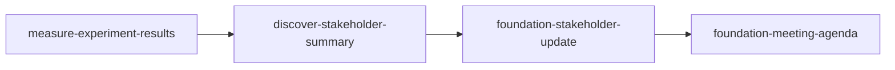

<!-- PM-Skills | https://github.com/product-on-purpose/pm-skills | Apache 2.0 -->
# Workflow Implementation Packet: quarterly-business-review

> Produced by `utility-pm-workflow-builder`. Everything below is a DRAFT in
> `_staging/workflows/quarterly-business-review/`; nothing has been written to
> a canonical location. A human reviews, promotes, and works the checklist.

## Decision

**Build it.** Recommend creating the `quarterly-business-review` workflow. The
Why Gate fired (the idea overlaps Post-Launch Learning and Stakeholder
Alignment) and was passed with three specific scenarios where existing
workflows fail:

1. "Prep the Q3 QBR for the payments platform" needs the quarter's experiment
   evidence AND a stakeholder map AND meeting materials in one pass; running
   Post-Launch Learning gets the evidence but stops before any stakeholder or
   meeting artifact exists.
2. "Our QBR pre-read goes out 48 hours before the meeting" requires a written
   async update as a distinct artifact; Stakeholder Alignment produces a
   problem case for buy-in, not a recurring results communication.
3. "New VP joined; reset who attends and what they care about" needs the
   stakeholder map refreshed each quarter as a first-class step, which no
   existing workflow sequences with results synthesis.

- **Workflow name:** `quarterly-business-review` (file: `_workflows/quarterly-business-review.md`)
- **Command:** `/workflow-quarterly-business-review` (file: `commands/workflow-quarterly-business-review.md`)
- **Steps:** `measure-experiment-results` -> `discover-stakeholder-summary` -> `foundation-stakeholder-update` -> `foundation-meeting-agenda`
- **Entry form:** chain-promotion. Originating chain expression, pasted from the orchestrator's completion suggestion: `measure-experiment-results -> discover-stakeholder-summary -> foundation-stakeholder-update -> foundation-meeting-agenda` with context "Q3 QBR for the payments platform team".

## Overlap Analysis

Scanned the live `_workflows/` directory (twelve files at scan time; the scan,
not this packet, is authoritative). Meaningful overlaps:

| Existing workflow | What it covers | Overlap | Why it does not fit |
|---|---|---|---|
| post-launch-learning | Instrumentation, dashboards, experiment results, retro, lessons | Medium (shares results synthesis) | Ends at team learning; produces no stakeholder map, pre-read, or meeting materials |
| stakeholder-alignment | Stakeholder summary, problem statement, solution brief, launch checklist | Medium (shares stakeholder mapping) | Builds a one-time buy-in case for a decision; a QBR is a recurring results-and-priorities communication |
| sprint-planning | Refinement, stories, edge cases | None | Different lifecycle moment entirely |

The gap: a recurring, evidence-first communication loop that ends in meeting
materials. No existing workflow sequences results synthesis into stakeholder
mapping into an async pre-read into an agenda.

## Workflow Draft

The complete draft of `_workflows/quarterly-business-review.md`:

```markdown
---
title: Quarterly Business Review
---

# Quarterly Business Review Workflow

> **Turn a quarter of experiment evidence into a stakeholder-ready QBR: results, who cares, the pre-read, and the meeting agenda.**

---

## Workflow Metadata

| Field | Value |
|-------|-------|
| **Workflow** | Quarterly Business Review |
| **Command** | `/workflow-quarterly-business-review` |
| **Skills** | `measure-experiment-results` -> `discover-stakeholder-summary` -> `foundation-stakeholder-update` -> `foundation-meeting-agenda` |
| **Phases Covered** | Measure, Discover, Foundation (cross-cutting) |
| **Estimated Duration** | 2-3 hours |
| **Prerequisite Inputs** | The quarter's experiment data or dashboard exports; the attendee list or org context for the review |
| **Final Output** | Results synthesis, refreshed stakeholder map, async pre-read update, and a time-boxed QBR agenda |

---

## When to Use This Workflow

Use the Quarterly Business Review workflow when:

- A recurring business review is coming up and the quarter's evidence needs to become decision-ready materials
- Leadership attendance or priorities shifted and the stakeholder picture needs a refresh before you communicate results
- You want the pre-read and the meeting agenda to tell the same story as the underlying data

**Do NOT use this workflow when:**

- You are mid-quarter and only need one experiment written up (use the `measure-experiment-results` skill directly)
- You are building a case for a specific decision rather than reviewing a period (use [Stakeholder Alignment](stakeholder-alignment.md))
- You want the team-internal learning loop after a launch (use [Post-Launch Learning](post-launch-learning.md))

---

## Workflow Steps

### Step 1: Experiment Results

**Skill:** [`measure-experiment-results`](../skills/measure-experiment-results/SKILL.md)

**What you do:** Compile the quarter's experiments into a single results synthesis: what ran, what moved, what was learned, and what it implies for next quarter's bets.

**Input requirements:**

- Experiment readouts, dashboard exports, or metric snapshots for the quarter
- The quarter's stated goals or OKRs for framing

**Output:** A results document with per-experiment outcomes and a quarter-level summary of wins, misses, and learnings.

**Handoff to next step:** The quarter-level summary (especially the misses and the asks they imply) tells the next step which stakeholders have skin in the game this cycle.

---

### Step 2: Stakeholder Summary

**Skill:** [`discover-stakeholder-summary`](../skills/discover-stakeholder-summary/SKILL.md)

**What you do:** Refresh the stakeholder map for this review cycle: who attends or reads, their influence and interest, what each cares about in this quarter's results, and any new players since last quarter.

**Input requirements:**

- The results summary from Step 1
- Attendee list, org chart context, or notes on recent leadership changes

**Output:** A stakeholder summary with influence/interest levels and per-stakeholder concerns tied to this quarter's outcomes.

**Handoff to next step:** The per-stakeholder concerns decide the pre-read's emphasis and translations; the audience mix (engineering vs leadership vs mixed) selects the update's audience variant.

---

### Step 3: Stakeholder Update

**Skill:** [`foundation-stakeholder-update`](../skills/foundation-stakeholder-update/SKILL.md)

**What you do:** Write the async pre-read that goes out before the meeting: the quarter's results translated for the mapped audience, with the primary call to action (decisions needed at the QBR) up front.

**Input requirements:**

- Results synthesis from Step 1
- Stakeholder map from Step 2 (audience variant and emphasis)
- The channel the pre-read ships on (email, Notion, exec memo)

**Output:** A channel-ready pre-read update with the CTA, results narrative, and per-audience translations.

**Handoff to next step:** The decisions the pre-read asks for become the agenda's Decision topics; everything already answered in the pre-read stays OUT of the meeting and frees agenda time.

---

### Step 4: Meeting Agenda

**Skill:** [`foundation-meeting-agenda`](../skills/foundation-meeting-agenda/SKILL.md)

**What you do:** Build the time-boxed QBR agenda (stakeholder-review or exec-briefing variant): decision topics from the pre-read's asks, discussion topics from the open misses, owners, and attendee prep pointing at the pre-read.

**Input requirements:**

- The pre-read from Step 3 (its CTA list becomes the Decision topics)
- Meeting length and attendee list

**Output:** An attendee-facing agenda with time-boxed, type-tagged topics and prep expectations.

---

## Context Flow Diagram



---

## Tips and Variations

**Recurring use:** Keep last quarter's packet beside this one; Step 2 starts from the previous map and only refreshes deltas, which cuts the run to about an hour.

**Lightweight version:** When the audience is unchanged since last quarter, skip Step 2 and reuse the prior stakeholder summary; the pre-read still consumes the fresh Step 1 results.

**Enhanced version:** Add `foundation-meeting-recap` after the QBR itself, then `iterate-lessons-log` for commitments made in the room; that closes the loop into next quarter's evidence base.

**Team collaboration:** Run Step 1 with the data owner, Steps 2-3 solo, and circulate the Step 3 pre-read for comment before locking the Step 4 agenda.

---

## Quality Checklist

Before considering this workflow complete, verify:

- [ ] Every experiment in the quarter appears in the Step 1 synthesis with an outcome (no silent omissions)
- [ ] The stakeholder map reflects THIS cycle's attendees, not last quarter's copy
- [ ] The pre-read's primary CTA states the decisions needed at the QBR, above the results narrative
- [ ] Agenda Decision topics match the pre-read's asks one-to-one
- [ ] Material already answered in the pre-read does not reappear as meeting discussion time

---

## See Also

- [Post-Launch Learning](post-launch-learning.md) - the team-internal learning loop after a single launch
- [Stakeholder Alignment](stakeholder-alignment.md) - building a buy-in case for one specific decision

---

*Part of [PM-Skills](../README.md) - Open source Product Management skills for AI agents*
```

## Command Draft

The complete draft of `commands/workflow-quarterly-business-review.md`:

```markdown
---
description: Run the Quarterly Business Review workflow (experiment-results -> stakeholder-summary -> stakeholder-update -> meeting-agenda)
---

Run the Quarterly Business Review workflow to turn a quarter of evidence into stakeholder-ready review materials.

This workflow uses multiple skills in sequence. For each step, read the skill instructions and follow them to create the artifact.

## Workflow Steps

### Step 1: Experiment Results

Use the `measure-experiment-results` skill from `skills/measure-experiment-results/SKILL.md`.

Compile the quarter's experiments into one results synthesis with wins, misses, and learnings.

### Step 2: Stakeholder Summary

Use the `discover-stakeholder-summary` skill from `skills/discover-stakeholder-summary/SKILL.md`.

Refresh the stakeholder map for this review cycle from the results and the attendee context.

### Step 3: Stakeholder Update

Use the `foundation-stakeholder-update` skill from `skills/foundation-stakeholder-update/SKILL.md`.

Write the async pre-read for the mapped audience with the decisions needed up front.

### Step 4: Meeting Agenda

Use the `foundation-meeting-agenda` skill from `skills/foundation-meeting-agenda/SKILL.md`.

Build the time-boxed QBR agenda from the pre-read's asks and the open discussion items.

## Output

Create all four artifacts in sequence, ensuring each builds on the previous.

Reference the Quarterly Business Review workflow at `_workflows/quarterly-business-review.md` for additional guidance.

Context from user: $ARGUMENTS
```

## Cross-Cutting Checklist

Adding this workflow trips every surface below. Work each row at promotion;
the right column names the validator that catches a miss, and the rows marked
**validator-blind** have NO net: this checklist is the only control.

- [ ] `_workflows/quarterly-business-review.md` created - `check-workflow-generator-coverage` (enforcing); `gen-site.mjs` emits the site page automatically (Pattern S: no hand-authored docs page)
- [ ] `commands/workflow-quarterly-business-review.md` created - `validate-commands` (enforcing)
- [ ] `AGENTS.md` workflows section + command list updated - `validate-agents-md`, `check-agents-md-command-sync` (enforcing)
- [ ] `README.md` workflow table row + workflow/command count phrasings - `check-count-consistency` (enforcing)
- [ ] `QUICKSTART.md` workflow and command count phrasings - `check-count-consistency` (enforcing)
- [ ] `site/src/content/docs/index.mdx` hand-authored workflow table + the guided-workflows count line - `check-landing-page-counts --strict` (enforcing)
- [ ] `site/src/content/docs/reference/runtime-components.md` content-library counts line (workflow and command counts) - `check-count-consistency` (enforcing)
- [ ] `.github/workflows/release.yml` release-note template's slash-command bullet - **validator-blind** (no validator scans YAML; the new `/workflow-quarterly-business-review` command makes the generated public release notes false until this bullet is updated by hand)
- [ ] `CHANGELOG.md` entry under `[Unreleased]` - release motion
- [ ] Regenerate the resource index if CI asks: `node scripts/gen-resource-index.mjs` - `gen-resource-index --check` (enforcing, CI-only)

## Promotion Steps

1. Move `workflow.md` to `_workflows/quarterly-business-review.md` and `command.md` to `commands/workflow-quarterly-business-review.md` (copy, verify, then delete staging).
2. Work the Cross-Cutting Checklist above, in order.
3. Run the validators named in the checklist locally; let CI run regardless (CI is a superset: it builds the site and checks rendered links).
4. Open a PR; squash-merge per repo convention (linear history).
