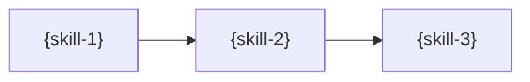

<!-- PM-Skills | https://github.com/product-on-purpose/pm-skills | Apache 2.0 -->
# Workflow Implementation Packet: {workflow-name}

> Produced by `utility-pm-workflow-builder`. Everything below is a DRAFT in
> `_staging/workflows/{workflow-name}/`; nothing has been written to a
> canonical location. A human reviews, promotes, and works the checklist.

## Decision

{One-paragraph recommendation: build this workflow / customize an existing
one / use /chain instead. If the Why Gate fired, list the 2-3 specific
scenarios where existing workflows fail; if the user overrode the gate,
record the override explicitly.}

- **Workflow name:** `{workflow-name}` (file: `_workflows/{workflow-name}.md`)
- **Command:** `/workflow-{workflow-name}` (file: `commands/workflow-{workflow-name}.md`)
- **Steps:** {ordered skill list}
- **Entry form:** {problem-first | skills-first | chain-promotion (paste the originating chain expression)}

## Overlap Analysis

{One row per existing workflow with meaningful overlap. Scan the live
_workflows/ directory; never a remembered list.}

| Existing workflow | What it covers | Overlap | Why it does not fit |
|---|---|---|---|
| {name} | {coverage} | {low/medium/high, estimate} | {the gap} |

{Closing line: the specific gap this new workflow fills.}

## Workflow Draft

{The COMPLETE draft of `_workflows/{workflow-name}.md`. The skeleton below is
the section inventory every shipped workflow carries; fill every section,
remove none.}

```markdown
---
title: {Display Name}
---

# {Display Name} Workflow

> **{One-line bold tagline: what goes in, what comes out.}**

---

## Workflow Metadata

| Field | Value |
|-------|-------|
| **Workflow** | {Display Name} |
| **Command** | `/workflow-{workflow-name}` |
| **Skills** | `{skill-1}` -> `{skill-2}` -> `{skill-3}` |
| **Phases Covered** | {phases} |
| **Estimated Duration** | {duration} |
| **Prerequisite Inputs** | {what the user must bring} |
| **Final Output** | {the artifact trail} |

---

## When to Use This Workflow

Use the {Display Name} workflow when:

- {trigger 1}
- {trigger 2}

**Do NOT use this workflow when:**

- {anti-trigger with a pointer to the neighboring workflow or skill that fits}

---

## Workflow Steps

### Step 1: {Step Title}

**Skill:** [`{skill-1}`](../skills/{skill-1}/SKILL.md)

**What you do:** {the human-level activity}

**Input requirements:**

- {input 1}

**Output:** {the artifact this step produces}

**Handoff to next step:** {what the next step consumes from this output}

---

{Repeat the step block for every step; the final step omits the handoff.}

## Context Flow Diagram



---

## Tips and Variations

{2-4 practical tips: lightweight variant, enhanced variant, team usage.}

---

## Quality Checklist

Before considering this workflow complete, verify:

- [ ] {testable completion check per step}

---

## See Also

- [{Neighbor workflow}]({neighbor}.md) - {when to use it instead}

---

*Part of [PM-Skills](../README.md) - Open source Product Management skills for AI agents*
```

## Command Draft

{The COMPLETE draft of `commands/workflow-{workflow-name}.md`, mirroring the
existing workflow-* command shape. One literal `skills/<name>/SKILL.md` path
per step is REQUIRED (validate-commands enforces at least one).}

```markdown
---
description: Run the {Display Name} workflow ({skill-1} -> {skill-2} -> {skill-3})
---

Run the {Display Name} workflow to {outcome}.

This workflow uses multiple skills in sequence. For each step, read the skill instructions and follow them to create the artifact.

## Workflow Steps

### Step 1: {Step Title}

Use the `{skill-1}` skill from `skills/{skill-1}/SKILL.md`.

{One-line step instruction.}

{Repeat per step.}

## Output

Create all artifacts in sequence, ensuring each builds on the previous.

Reference the {Display Name} workflow at `_workflows/{workflow-name}.md` for additional guidance.

Context from user: $ARGUMENTS
```

## Cross-Cutting Checklist

Adding a workflow trips every surface below. Work each row at promotion;
the right column names the validator that catches a miss, and the rows
marked **validator-blind** have NO net: this checklist is the only control.

- [ ] `_workflows/{workflow-name}.md` created (the draft above) - `check-workflow-generator-coverage` (enforcing); `gen-site.mjs` emits the site page automatically (Pattern S: no hand-authored docs page)
- [ ] `commands/workflow-{workflow-name}.md` created - `validate-commands` (enforcing); a command-less workflow must instead join `check-workflow-coverage`'s documented optional list (advisory)
- [ ] `AGENTS.md` workflows section + command list updated - `validate-agents-md`, `check-agents-md-command-sync` (enforcing)
- [ ] `README.md` workflow table row + workflow/command count phrasings - `check-count-consistency` (enforcing)
- [ ] `QUICKSTART.md` workflow and command count phrasings - `check-count-consistency` (enforcing)
- [ ] `site/src/content/docs/index.mdx` hand-authored workflow table + the guided-workflows count line - `check-landing-page-counts --strict` (enforcing)
- [ ] `site/src/content/docs/reference/runtime-components.md` content-library counts line (workflow and command counts) - `check-count-consistency` (enforcing)
- [ ] `.github/workflows/release.yml` release-note template's slash-command bullet - **validator-blind** (no validator scans YAML; a new workflow command makes the generated public release notes false until this is updated BY HAND)
- [ ] `CHANGELOG.md` entry under `[Unreleased]` - release motion
- [ ] Regenerate the resource index if CI asks: `node scripts/gen-resource-index.mjs` - `gen-resource-index --check` (enforcing, CI-only)

## Promotion Steps

1. Move `workflow.md` to `_workflows/{workflow-name}.md` and `command.md` to `commands/workflow-{workflow-name}.md` (copy, verify, then delete staging).
2. Work the Cross-Cutting Checklist above, in order.
3. Run the validators named in the checklist locally; let CI run regardless (CI is a superset: it builds the site and checks rendered links).
4. Open a PR; squash-merge per repo convention (linear history).
